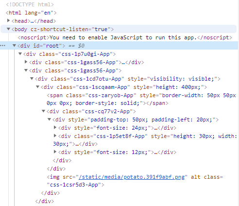

## 1. emotion.js란?

emotion.js는 CSS-in-JS의 하나로, CSS를 JavaScript 안에서 작성하게 해준다.

### CSS-in-JS란?

> [JSS는 CSS보다 더 강력한 추상화](https://medium.com/@oleg008/jss-is-css-d7d41400b635)입니다. JavaScript를 사용하여 스타일을 선언적이고, 유지보수 가능한 방식으로 설명합니다. JS를 CSS로 전환하는 고성능 컴파일러로, 런타임 및 서버 사이드에서 작동합니다. 이 코어 라이브러리는 낮은 레벨이며, 프레임워크에 구애받지 않습니다. 약 6KB(gzip압축과 minify함)이며 플러그인 API를 통해 확장 가능합니다.—[출처](https://medium.com/@oleg008/jss-is-css-d7d41400b635)

<br>

emotion.js에는 두가지 방법이 있는데, 하나는 framework agnostic<span style="font-size: 14px;">(\*쉽게 말하면 프레임워크를 사용하지 않는 것)</span>, 하나는 React로 만든 것이다.

_해당 글은 @emotion/core 10.0.28 기준으로 작성되었다._

## 2. emotion.js 사용법

```sh
# Framework Agnostic
$ npm install emotion

# React
$ npm install @emotion/core
```

_해당 글은 React를 기준으로 작성한다._

emotion.js를 사용해야 할 컴포넌트에 먼저 import를 해야 한다.

```js{1}
/** @jsx jsx */
import { jsx, css } from '@emotion/core'
```

`/** @jsx jsx */`는 babel에게 `React.createElement` 대신 jsx를 jsx라는 함수로 변환하라는 뜻이다. <span style="font-size: 14px;">(출처: [jsx-pragma](https://emotion.sh/docs/css-prop#jsx-pragma))</span>

단순히 주석이라 생각하고 쓰지 않는다면 `@emotion/core`가 적용되지 않는다.

공식 문서에 있는 예문을 같이 살펴보자.

<iframe
     src="https://codesandbox.io/embed/emotionjs-intro-1ysvo?fontsize=14&hidenavigation=1&theme=dark"
     style="width:100%; height:500px; border:0; border-radius: 4px; overflow:hidden;"
     title="emotion.js intro"
     allow="accelerometer; ambient-light-sensor; camera; encrypted-media; geolocation; gyroscope; hid; microphone; midi; payment; usb; vr; xr-spatial-tracking"
     sandbox="allow-autoplay allow-forms allow-modals allow-popups allow-presentation allow-same-origin allow-scripts"
></iframe>

(기존 예문에서 구조만 살짝 수정했다)

```js
/** @jsx jsx */
import { css, jsx } from '@emotion/core'

const divStyle = css`
  background-color: hotpink;
  font-size: 24px;
  border-radius: 4px;
  padding: 32px;
  text-align: center;
  &:hover {
    color: white;
  }
`

export default function App() {
  return <div css={divStyle}>Hover to change color.</div>
}
```

기존에 Styled-Component를 써본 사람이라면 익숙한 구조일 것이다.

```js
// Styled-Component
import styled from 'styled-components'

const DivStyle = styled.div`
  background-color: hotpink;
  font-size: 24px;
  border-radius: 4px;
  padding: 32px;
  text-align: center;
  &:hover {
    color: white;
  }
`

export default function App() {
  return <DivStyle>Hover to change color.</DivStyle>
}
```

개인적으로 `emotion.js`가 더 편하다고 느낀 점은, jsx안에서 이게 어떤 태그인지 바로 알 수 있다는 점이다.

`Styled-Component`는 component에 `div`, `p`등을 써놓지 않으면 이게 어떤 태그인지 바로 알 수 없다. 만약 해당 js파일에 내용이 많아 일일히 찾아야 한다면 엄청 번거롭다.

또한, `emotion.js`는 `Styled-Component`처럼 브라우저에서 열었을 때 className을 임의로 생성해준다.

<p style="text-align: center;"></p>

`emotion.js`는 [babel-plugin-emotion](https://emotion.sh/docs/babel-plugin-emotion)을 사용하면 커스터마이징이 가능하다.

```sh
$ npm install --save-dev babel-plugin-emotion
# or
$ yarn add --dev babel-plugin-emotion
```

```js{10}
const divStyle = css`
  background-color: hotpink;
  font-size: 24px;
  border-radius: 4px;
  padding: 32px;
  text-align: center;
  &:hover {
    color: white;
  }
  label: divStyle;
`
```

```html
<div class="css-mfy11-divStyle">
  ...
</div>
```

이렇게 바로 `css`에 label을 넣어 변경하는 방법도 있지만, 이는 매번 label 값을 넣어줘야 하고, 다른 개발자들과 같이 일하기에도 불편하기 때문에 `.babelrc`를 만들어 저장하는 것을 권장한다.

`.babelrc`

```json
{
  "plugins": [
    [
      "emotion",
      {
        "autoLabel": true,
        "labelFormat": "[dirname]-[filename]-[local]"
      }
    ]
  ]
}
```

_아직 .babelrc의 정확한 적용 방법을 모르겠다... 확인해보고 추후 추가 예정_

이 방법 외, 최근 CRA에서는 [Babel Macros](https://emotion.sh/docs/babel-macros)를 지원하고 있다. 이는 Babel config없이 babel를 전환할 수 있는 것인데, `Styled-Component`도 이를 통해 className 라벨을 수정할 수 있다.

하지만 아직 Babel Macros는 몇 최적화 작업이 불가능하기 때문에 `babel-plugin-emotion` 사용을 권장하고 있다.

<br>

### 왜 CSS-in-JS를 사용할까?

2014년 Facebook 개발자 Christopher Chedeau aka Vjeux의 발표 내용이다.

> Global namespace: 클래스 이름 중복문제
> Dependencies : 스타일 상속에 의한 중복
> Dead Code Elimination: 미사용 코드 처리
> Minification: 클래스이름 최소화
> Sharing Constants: 자바스크립트 코드와 값을 연동
> Non-deterministic Resolution: CSS 로드 순서에 따른 캐스테이드 스타일 변화
> Isolation: 상속에 의한 영향이 없도록 격리

인터넷 글을 보면 대부분 '디자이너와 협업을 더 원활히 하기 위해'라고 되어있다.

하지만 CSS-in-JS는 단순히 개발자들이 더 쓰기 편하게 하기 위해 생겨난 것이지, 디자이너와 협업을 위해 만들어진 것이 아닌 것 같다.

컴포넌트로 생각하기— 더이상 스타일시트의 묶음을 유지보수 할 필요가 없습니다. CSS-in-JS는 CSS 모델을 문서 레벨이 아니라 컴포넌트 레벨로 추상화합니다(모듈성).
CSS-in-JS는 JavaScript 환경을 최대한 활용하여 CSS를 향상시킵니다.
"진정한 분리 법칙"—스코프가 있는 선택자로는 충분하지 않습니다. CSS에는 명시적으로 정의 하지 않은 경우, 부모 요소에서 자동으로 상속되는 속성이 있습니다. jss-isolate 플러그인 덕분에 JSS 규칙은 부모 요소의 속성을 상속하지 않습니다.
스코프가 있는 선택자—CSS는 하나의 전역 네임스페이스만 있습니다. 복잡한 애플리케이션 내에서 선택자 충돌을 피할 수 없습니다. BEM과 같은 네이밍 컨벤션은 한 프로젝트 내에서는 도움이 되지만, 서드파티 코드를 통합할 때는 도움이 되지 않습니다. JSS는 JSON으로 표현된 것을 CSS로 컴파일 할 때, 기본적으로 고유한 이름을 생성합니다.
벤더 프리픽스—생성된 CSS 규칙은 자동적으로 벤더 프리픽스가 붙어있으므로 생각할 필요가 없습니다.
코드 공유—JavaScript와 CSS사이에 상수와 함수를 쉽게 공유할 수 있습니다.
현재 화면에 사용중인 스타일만 DOM에 있습니다(react-jss).
죽은 코드 제거
CSS 유닛 테스트!

JSS (Framework 관계없이 사용 가능, material-ui에서 사용)
Styled-components (컴포넌트기반 framework에 최적화, 인기 많은데 요새 emotion.js가 치고 올라오는 중)

<br>

**참고**

<div style="font-size: 12px;">

- https://d0gf00t.tistory.com/22
- https://medium.com/@okys2010/%EB%AA%A8%EB%8D%98-css-1-css-in-js-c1c53d9bbbc9

- https://orezytivarg.github.io/css-evolution-from-css-sass-bem-css-modules-to-styled-components/

- https://ideveloper2.dev/blog/2019-05-05--thinking-about-emotion-js-vs-styled-component/

<div>
