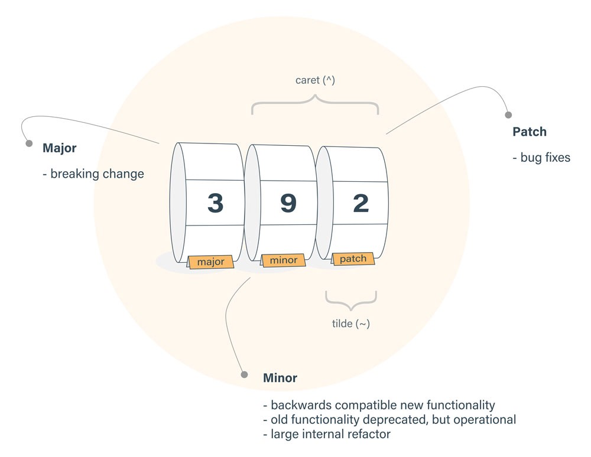
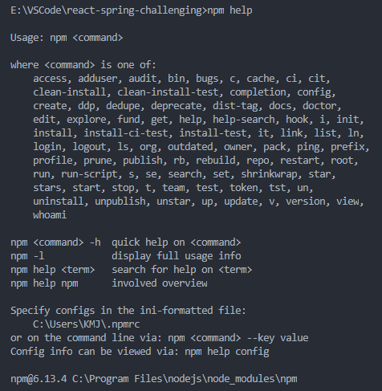

## 1. npm이란?

React, Vue, Angular 등 자바스크립트 프레임워크를 사용해 본 사람이라면 `npm`이란 단어를 많이 접해봤을 것이다.

하지만 npm이 무엇이고, 어떻게 사용되는지 아는 사람은 많이 없다고 생각한다.

[npm](https://www.npmjs.com/)은 Node Package Manager의 줄임말로 Node.js 패키지 관리를 원활하게 도와주는 것이다.

> [Node.js](https://nodejs.org/ko/)는 크롬의 자바스크립트 엔진(V8 Engine)에 기반해 만들어진 서버 사이드 플랫폼이다.
> <span style="font-size: 12px;">(\*서버 사이드 렌더링, SSR: 브라우저에 나타나는 형태 그대로를 HTML로 만들어 제공)</span>
>
> Node.js는 이벤트 기반, Non-Blocking I/O 모델을 사용해 가볍고 효율적이다.
>
> Node.js의 패키지 생태계인 npm은 세계에서 가장 큰 오픈 소스 라이브러리이기도 하다.

<br>

npm은 세 가지 요소로 구성되어 있다.

**1. [Website](https://www.npmjs.com/)**

- 웹사이트를 통해 패키지들을 찾고, 관련 문서를 볼 수 있으며, 패키지를 공유하고 배포할 수 있다.

**2. [CLI](https://docs.npmjs.com/cli/npm)**

- Command Line Interface의 줄임말로, 터미널을 뜻한다.
- 대부분의 개발자들이 CLI를 통해 npm 패키지 업데이트/설치/제거/관리를 할 수 있다.

**3. [Registry](https://docs.npmjs.com/misc/registry)**

- 레지스트리는 큰 규모의 public 데이터베이스를 뜻하며, npm 레지스트리에는 자바스크립트 소프트웨어와 메타 정보들이 들어 있다.
- 현재 npm 레지스트리에는 100만개 이상의 패키지들가 있다.
- package.json에 `private: true`를 설정하면 공개적 배포를 막아 줄 수 있다. (기본적으로 개인이 만든 CRA는 다 true로 설정되어 있다.)

## 2. npm으로 무엇을 할 수 있을까?

- 패키지의 코드들을 자신의 앱에 맞게 조정하거나, 그대로 사용할 수 있다.
- 바로 사용 가능한 독립적인 툴들을 다운로드 받을 수 있다.
- [npx](https://www.npmjs.com/package/npx)를 사용하여 다운로드하지 않고 패키지를 실행할 수 있다.
- 어디에서든 npm 사용자끼리 코드를 공유할 수 있다.
- 특정 개발자에게만 코드를 제한할 수 있다.
- 패키지 유지관리, 코딩 및 개발자를 조정하는 [Orgs](https://docs.npmjs.com/orgs/)(조직)을 만들 수 있다.
- [Orgs](https://docs.npmjs.com/orgs/)로 가상 팀을 구성할 수 있다.
- 여러 버전의 코드 및 코드 종속성 관리가 가능하다.
- 기존 코드가 업데이트 될 때 앱도 쉽게 업데이트 할 수 있다.
- 같은 문제를 다양한 방법으로 푸는 해결책을 찾을 수 있다.
- 유사한 문제와 프로젝트를 진행 중인 다른 개발자를 찾을 수 있다.

<br>

공식 홈페이지에 들어가기 전까지 npm은 단순하게 패키지를 설치하는 거라고만 알고 있었다.
하지만 단순히 패키지를 다운받는 것에 그치지 않고, npm [커뮤니티](https://npm.community/)에 자주 들어가보면 나에게 필요한 것을 많이 찾을 수 있을 것 같다.

## 3. npm 설치하기

npm은 Node.js를 통해 다운받아야 한다.

Node의 설치 유무를 보기 위해 버전 체크를 해보자.

```sh
node -v
npm -v
```

아무 숫자도 뜨지 않는다면 [다운로드](https://nodejs.org/en/download/)를 받아야 한다.

다운로드를 하고 다시 버전을 쳐보면 정상적으로 숫자가 나오는 것을 확인할 수 있다.

그 후, `package.json` 생성을 위해 아래와 같은 코드를 치자.

```sh
npm init
# or 질문 없이 바로 시작하고 싶다면
npm init -y
```

`package.json`은 프로젝트의 mainfest<span style="font-size: 11px;">(\*컴퓨팅에서 집합의 일부 또는 논리정연한 단위인 파일들의 그룹을 위한 메타데이터를 포함하는 파일)</span> 파일이다. 프로젝트 정보와 의존성(dependencies)을 관리할 수 있으며 작성된 `package.json` 문서로 어느 곳에서든 동일한 개발 환경을 구축할 수 있게 해준다.

<br>

`package.json`

```json
{
  "name": "project-name", // 이름
  "version": "1.0.0", // 버전
  "keywords": [
    // 키워드, 배열로 작성
    "howdy",
    "mj"
  ],
  "description": "", // 설명
  "main": "index.js",
  "scripts": {
    // 스크립트
    "test": "echo \"Error: no test specified\" && exit 1"
  },
  "author": "MJ", // 작성자
  "license": "MIT",
  "dependencies": {
    "react": "^16.13.1",
    "react-dom": "^16.13.1",
    "react-scripts": "3.4.1",
    "react-spring": "^9.0.0-rc.3"
  },
  "devDependencies": {}
}
```

## 4. npm 버전



<p style="text-align: center; font-size: 10px">https://medium.com/beginners-guide-to-mobile-web-development/introduction-to-npm-and-basic-npm-commands-18aa16f69f6b</p>

모든 패키지에는 세 가지 숫자가 존재하며 순서대로 major, minor, patch이다.

**major**는 기존 코드를 깨뜨릴 만큼 큰 변화가 업데이트 됐을 때 바뀐다.

**minor**(^)는 기존 코드를 유지하면서 새로운 기능이 추가 되었을 때 사용한다.

**patch**(^, ~)는 버그를 수정했을 때 사용한다.

`예시`

```json
"dependencies": {
    "react": "^16.13.1",
    "react-dom": "^16.13.1",
    "react-scripts": "3.4.1",
    "react-spring": "^9.0.0-rc.3"
  },
```

특정 버전의 패키지를 다운받고 싶다면 아래처럼 쓰면 된다:

```sh
npm install 패키지명@x.y.z
```

## 5. npm 명령어

### Getting help:

```sh
npm help # npm 관련 도움
npm <command> -h # 특정 command 도움
```

<p style="text-align: center"></p>
<p style="text-align: center; font-size: 12px">npm help 쳤을 때 화면</p>

### Installing packages:

두 가지 설치 방법이 있다.

첫 번째, 오직 현재 폴더(directory)에서만 패키지를 사용할 것이라면 **로컬**에 설치 한다.

```sh
npm install 패키지명
```

두 번째, 현재 폴더뿐만 아니라 어디서든 패키지를 사용할 것이라면 **전역**에 설치한다.

```sh
npm install 패키지명 -g
```

### Updating packages:

설치한 패키지가 새로운 기능을 가진 버전으로 업데이트 될 때가 있다.
이럴 때 update란 명령어를 사용하면 된다.

```sh
npm update 패키지명    # 특정 패키지 업데이트
npm update            # 전체 패키지 업데이트
npm update 패키지명 -g # 전역 패키지 업데이트
```

### Uninstalling packages:

설치했던 패키지가 더이상 필요 없어진다면 패키지를 삭제해서 `node_modules`안의 내용도 없애 주는 것이 좋다.

```sh
npm uninstall 패키지명
# or
npm r 패키지명

# 전역에서 삭제
npm uninstall 패키지명 -g
# or
npm r 패키지명 -g
```

### Installing from package.json:

프로젝트를 공유할 때 용량이 큰 _node modules_ 를 공유하기보단, `package.json`을 공유하면 다른 사람도 쉽게 패키지를 다운 받을 수 있다.

```sh
npm install
```

### List of installed packages:

설치한 패키지를 확인하는 방법은 직접 `package.json`을 열어보는 방법과 CLI에 치는 방법이 있다.

```sh
npm list
```

## 6. npm 배포하기

npm 배포를 하려면 먼저 [npm 회원가입](https://www.npmjs.com/signup)이 필요하다.

### npm 로그인

회원가입을 했다면 터미널에서 `npm login`을 입력하고 계정 정보를 입력해야 한다.

```sh
$ npm login
# Username:
# Password:
# Email
Logged in as howdy-mj on https://registry.npmjs.org/
```

제대로 로그인이 됐는지 확인하고 싶다면 `npm whoami`를 입력하면 본인의 Username이 출력될 것이다.

### 패키지명 결정

패키지를 배포하기 위해서는 패키지명을 정해야 한다.
사용하고 싶은 패키지명이 중복되는지 npm 사이트에서 검색하거나, 터미널에서 `npm info 패키지명`을 입력하면 확인할 수 있다.
정보가 나온다면 이미 존재하는 패키지명이고, `404` 에러가 뜨면 아직 없는 패키지명이라 사용 가능하다.

### 패키지 생성

우선 `howdy-first`라는 폴더를 만들고 안에 `package.json` 파일을 만들어 주겠다.

`package.json`

```json
{
  "name": "howdy-first",
  "version": "0.1.0"
}
```

### 패키지 배포

이제 터미널에 `npm publish`를 입력하면 배포가 완료된다.

```sh
$ npm publish
D:\VSCode\hooks-practice\src\howdy-first>npm publish
npm notice
npm notice package: howdy-first@0.0.0
npm notice === Tarball Contents ===
npm notice 589B UseTitle.js
npm notice 54B  package.json
npm notice === Tarball Details ===
npm notice name:          howdy-first
npm notice version:       0.0.0
...,
+ howdy-first@0.0.0
```

[howdy-first 패키지 보러가기](https://www.npmjs.com/package/howdy-first)
(package.json에 아무것도 쓰지 않아서 내용이 없다)

<br>

**참고**

- https://www.npmjs.com/
- https://medium.com/beginners-guide-to-mobile-web-development/introduction-to-npm-and-basic-npm-commands-18aa16f69f6b
- https://medium.com/@shgautam/why-package-json-npm-basics-cab3e8cd150
- https://www.daleseo.com/js-npm-publish/
