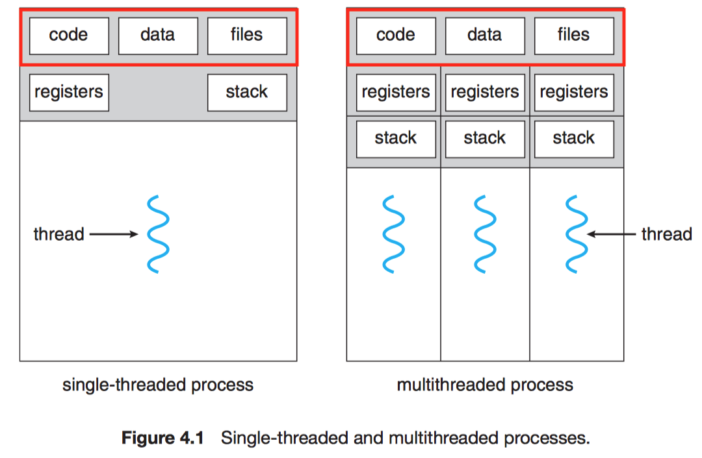

## Node.js란 무엇인가?

대부분 npm은 아래처럼 기술되어 있다.

- npm은 Node Package Manager의 줄임말로 Node.js 패키지 관리를 원활하게 도와주는 것이다.
- npm은 Node.js의 패키지 생태계이면서 세계에서 가장 큰 오픈 소스 라이브러리이다.

그렇다면 Node.js란 무엇일까?

[공식 홈페이지](https://nodejs.org/en/about/)에서는 Node.js®는 Chrome V8 JavaScript 엔진으로 빌드된 JavaScript 런타임이다. Node.js는 단일 스레드 이벤트 루프 기반, Non-Blocking I/O 모델을 사용해 가볍고 효율적이라 정의하고 있다.

그럼 다음의 키워드에 대해 하나씩 살펴보자.

- V8
- 자바스크립트 엔진
- 런타임
- Non-Blocking I/O
- 단일 스레드
- 이벤트 루트 기반

### V8

[V8](https://v8.dev/)은 C++로 작성된 구글의 오픈소스 고성능 자바스크립트와 WebAssembly(웹어셈블리: JavaScript API를 사용하여 최신 웹 브라우저에서 실핼할 수 있는 새로운 유형의 코드) 엔진이다. Node.js의 런타임으로도 사용된다.

### 자바스크립트 엔진(JavaScript Engine)

자바스크립트 코드를 해석하고 실행하는 프로그램 또는 인터프리터(\*interpreter: 프로그래밍 언어를 바로 실행하는 컴퓨터 프로그램 또는 환경)이다. 위에 설명한 V8가 대표적인 자바스크립트 엔진 중 하나다.

HTML 파서는 script 태그를 만나면 자바스크립트 코드를 실행하기 위해 DOM 생성 프로세스를 중지하고 자바스크립트 엔진으로 제어 권한을 넘긴다. 제어 권한을 넘겨 받은 자바스크립트 엔진은 script 태그 내의 자바스크립트 코드 또는 자바스크립트 파일을 로드하고 파싱(Parsing)하여 실행한다. 자바스크립트의 실행이 완료되면 다시 HTML 파서로 제어 권한을 넘겨서 브라우저가 중지했던 시점부터 DOM 생성을 재개한다.

### 런타임(Runtime)

런타임은 프로그램이 실행되고 있을 때 존재하는 곳을 말한다. 즉 컴퓨터 내에서 프로그램이 가동되면, 그것이 바로 그 프로그램의 런타임이다.
원래 자바스크립트는 웹 브라우저에서만 사용할 수 있었지만, Node.js를 통해 서버 사이드 애플리케이션에서도 사용가능한 범용 개발 언어가 되었다. 그럼에도 자바스크립트는 여전히 웹에서 제일 많이 사용된다.

### 스레드(Thread)

스레드는 어떠한 프로그램 내에서, 특히 프로세스(\*운영체제로부터 자원을 할당받는 작업의 단위) 내에서 실행되는 흐름의 단위를 말한다. 일반적으로 한 프로그램은 하나의 스레드를 갖고 있지만, 프로그램 환경에 따라 둘 이상의 스레드를 동시에 실행할 수 있다.

https://walkccc.github.io/CS/OS/Chap04/

**스레드와 프로세스**

프로세스는 실행될 때 운영체제로부터 CPU 시간, 필요한 주소 공간, code, data, stack, heap의 구조로 된 독립된 메모리 영역 등 자원을 할당 받는다.
스레드는 한 프로세스 내에서 동작되는 여러 실행의 흐름으로, 프로세스 내의 주소 공간이나 자원들(ex. heap 공간 등)을 같은 프로세스내에 스레드끼리 공유하면서 실행된다.

 

자바스크립트는 한번에 하나의 작업만 수행할 수 있는 **싱글 스레드(Single-Thread)**이다. 싱글 스레드는 먼저 들어온 요청을 전부 처리할 때까지 다른 요청을 받지 못한다. 따라서 자바스크립트에서는 비동기적 작업이 필수이다.

단일 스레드: 적은 양의 자원으로 일을 처리할 수 있다는 장점, 하지만 어느 한곳에 예외상황 및 에러가 발생하면 전체 애플리케이션에 영향이 간다.

### 이벤트 루프(Event Loop)

이벤트 루프는 작업을 요청하면서 그 작업이 완료되었을 때 어떤 작업을 진행할지에 대한 콜백 함수를 지정하여 **동작이 완료되었을 때 해당 콜백 함수를 실행되는 동작 방식**을 말한다. 즉, 이벤트 발생 시 호출되는 콜백 함수들을 관리하여 태스크 큐(task queue)에 전달하고, 이를 콜 스택(call stack)에 넘겨준다.

https://medium.com/@vdongbin/javascript-%EC%9E%91%EB%8F%99%EC%9B%90%EB%A6%AC-single-thread-event-loop-asynchronous-e47e07b24d1c

발생한 이벤트에 대해서만 웹서버가 연결해주기 때문에 자원을 최소화할 수 있는 장점이 있다. 대부분의 웹서버는 사용자가 이벤트를 발생하기까지를 기다리면서 자원(대기시간/메모리)을 계속 소비한다.

### Blocking & Non-Blocking I/O

I/O(input/output)은 데이터나 정보 등을 가공하는 프로세스의 전처리와 후처리라 생각하면 된다.

**Blocking I/O**는 Reade/Write 이벤트가 발생하면 이벤트가 끝날 때까지 해당 모듈을 점유하게 된다. 즉 다른일은 못한다. 또한 메모리 버퍼에 데이터를 차지하게 되므로 메모리도 소비한다.

이러한 비효율성을 극복하고자 나온 것이 **Non-blocking I/O**이다. 비동기(async) 방식이기 때문에 I/O 작업을 진행하는 동안 유저 프로세스의 작업을 중단하지 않는다.
Non-Blocking I/O의 경우 Read/Write 이벤트가 시작하자마자 모듈을 변환시켜 다른 작업을 하도록 준비상태가 된다. 그래서 속도가 동기식보다 빠르고 메모리도 덜 차지하게 된다.

## Node.js는 JavaScript만 돌아갈까?

node.js 파이썬 연동

**참고**

- https://junspapa-itdev.tistory.com/3
- https://geonlee.tistory.com/92
- https://asfirstalways.tistory.com/43
- https://poiemaweb.com/js-browser
- https://edu.goorm.io/learn/lecture/557/%ED%95%9C-%EB%88%88%EC%97%90-%EB%81%9D%EB%82%B4%EB%8A%94-node-js/lesson/21763/%EC%9D%B4%EB%B2%A4%ED%8A%B8-%EA%B8%B0%EB%B0%98-%EB%B9%84%EB%8F%99%EA%B8%B0-%EB%B0%A9%EC%8B%9D
- https://ko.wikipedia.org/wiki/%EC%8A%A4%EB%A0%88%EB%93%9C_(%EC%BB%B4%ED%93%A8%ED%8C%85)
- https://gmlwjd9405.github.io/2018/09/14/process-vs-thread.html
- https://medium.com/@vdongbin/javascript-%EC%9E%91%EB%8F%99%EC%9B%90%EB%A6%AC-single-thread-event-loop-asynchronous-e47e07b24d1c
- https://ui.toast.com/fe-guide/ko_DEPENDENCY-MANAGE/
