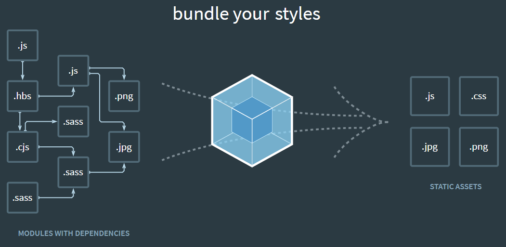

<p style="font-style: italic; font-size: 14px">해당 글에서 자세히 설명되지 않은 용어는 <a href="https://howdy-mj.netlify.app/general/about-npm">npm:소개, 설치, 명령어, 배포</a> 글에서 볼 수 있다.</p>

## Webpack이 나오게 된 배경

다른 사람이 만들어 둔 함수, 혹은 자신이 만들어둔 것을 나중에 다른 곳에서 import하여 쓰고 싶다면 모듈로 만들어 쓸 수 있다.

하지만 자바스크립트는 모두 같은 전역 스코프에 해당하기 때문에 자칫 잘못하면 스코프 오염이 생기면서 런타임 에러가 발생할 수 있다.

그래서 정의되자마자 즉시 실행되는 함수([IIFE](https://developer.mozilla.org/ko/docs/Glossary/IIFE))로 오염을 방지했다.

```js
;(function() {
  function add(a, b) {
    return a + b
  }
})()
```

이러한 방식으로 자바스크립트 모듈을 구현하는 대표적인 명세에 AMD와 CommonJS가 있다.

CommonJS는 자바스크립트를 사용하는 모든 환경에서 모듈을 하는 것이 목표로, `exports` 키워드로 모듈을 만들고 `require()` 함수로 불러 들이는 방식이다. 대표적으로 서버 사이드 플랫폼인 Node.js에서 이를 사용한다.

AMD(Asynchronous Module Definition)는 비동기로 로딩되는 환경에서 모듈을 사용하는 것이 주 목표로, 주로 브라우저 환경이다.

UMD(Universal Module Definition)는 AMD 기반으로 CommonJS 방식까지 지원하는 통합 형태이다.

`add.js`

```js
exports function add(a, b) {
    return a + b;
}
```

`app.js`

```js
const math = require('./add.js')
math.add(1, 2) // output: 3;
```

이렇게 만든 모듈을 `index.html`에서 불러오면 사용가능하다.

```html
<script type="module" src="./A.js"></script>
```

하지만 아직 모든 브라우저에서 모듈 시스템을 지원하지 않는다. 그래서 웹팩이 나오게 되었다.

## 웹팩 원리



[Webpack](https://webpack.js.org/)의 메인 화면이다. 왼쪽을 보면 여러 모듈들이 얽혀있다. 위에서 `app.js`에서 `add.js`를 불러와 사용하는 것을 예로 들 수 있다.

웹팩 번들링 작업을 위해 webpack 패키지와 webpack-cli를 설치해야 한다.

**참고**

<div style="font-size: 12px;">

- https://jeonghwan-kim.github.io/series/2019/12/10/frontend-dev-env-webpack-basic.html

</div>
