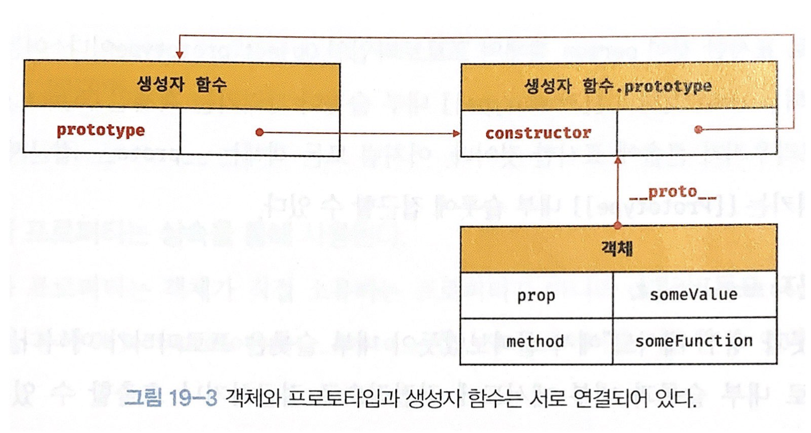
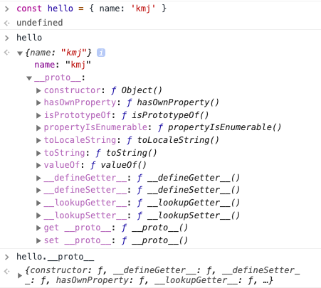

> 자바스크립트는 명령형, 함수형, 프로토타입 기반 객체지향 프로그래밍을 지원하는 멀티 패러다임 프로그래밍 언어다.

<br />

ES6에서 Class(이하 클래스)가 도입되긴 했지만, 다른 언어에서 사용되는 클래스와는 차이가 존재한다. 그건 자바스크립트가 <i>프로토타입 기반 언어</i> 이기 때문이다.

우선 클래스의 가장 큰 특징은 상속(inheritance)이 가능하다는 것이다. 상속은 객체지향 프로그래밍의 핵심 개념으로, 어떤 객체의 프로퍼티 또는 메서드를 다른 객체가 그대로 사용할 수 있는 것을 말한다.

```js
// 클래스의 상속
function Greeting(name) {
  this.name = name
  this.hello = function() {
    console.log(`hello ${name}`)
  }
}

const mj = new Greeting('mj')
mj.hello() // output: hello mj
```

이때 자바스크립트는 프로토타입을 기반으로 상속을 구현하여, 중복되는 것을 제거할 수 있다.

```js
// 자바스크립트 프로토타입 기반의 상속
function Greeting(name) {
  this.name = name
}

Greeting.prototype.hello = function() {
  console.log(`hello ${name}`)
}

const mj = new Greeting('mj')
mj.hello() // output: hello mj
```

그렇다면 **'프로토타입'**이 정확히 무슨 뜻일까?

## 프로토타입(prototype) 객체

ECMA-262에서 prototype은 **'object that provides shared properties for other objects'**이라고 되어있다. 즉, 프로토타입은 다른 객체에 공유 프로퍼티(메서드 포함)을 제공하는 객체이다.

모든 객체는 `[[Prototype]]`이라는 내부 슬롯을 갖으며, 상속을 구현하는 프로토타입 객체를 가리킨다. 하지만

<div style="text-align: center;">
  
  <p style="font-size: 12px; color: gray;">모던 자바스크립트 Deep Dive, 이웅모</p>
</div>

단, `[[Prototype]]` 내부 슬롯에는 직접 접근이 불가하며, `__proto__` 프로퍼티를 사용해 간접적으로 프로토타입에 접근할 수 있다.

<br />

### \_\_proto\_\_

모든 객체는 `__proto__`를 통해 자신의 프로토타입(`[[Prototype]]` 내부 슬롯)에 접근할 수 있다.

<div style="text-align: center;">
  
</div>

<br />

### 함수 객체의 prototype 프로퍼티

`prototype` 프로퍼티는 생성자 함수로 호출할 수 있는 객체, 즉 constructor만이 소유하는 프로퍼티다. 일반 객체와 생성자 함수로 호출할 수 없는
non-constructor에는 `prototype` 프로퍼티가 없다.

```js
// 함수 객체는 prototype 프로퍼티가 있음
function func() {}
func.hasOwnProperty('prototype') // output: true

// 일반 객체는 prototype 프로퍼티가 없음
const obj = {}
obj.hasOwnProperty('prototype') // output: false
```

단, 화살표 함수와 ES6 메서드 축약 표현으로 정의된 메서드는 non-constructor로 `prototype` 프로퍼티가 없다.

```js
// 화살표 함수
const arrowFunc = () => {}
arrowFunc.hasOwnProperty('prototype') // output: false

// ES6 축약 메서드
const es6 = {
  test() {},
}
es6.test.hasOwnProperty('prototype') // output: false
```

## 생성자 함수와 프로토타입

생성자 함수에 의해 생성된 객체는 constructor 프로퍼티를 통해 생성자 함수와 연결된다.

```js
function Person(name) {
  this.name = name
}
const me = new Person('kmj') // Person 생성자로 만들어진 me 객체
me.constructor === Person // output: true
```

생성자 함수로 생성한 것이 아닌, 리터럴 표기법으로 생성하여도 constructor 프로퍼티가 연결된다.

```js
const person = function(name) {
  this.name = name
}
person.constructor === Function // output: true
```

이처럼 리터럴 표기법에 의해 생성된 객체도 상속을 위해 프로토타입이 필요하며, 이는 곧 constructor 프로퍼티와 연결된다. 즉, **프로토타입과 생성자 함수는 늘 함께 존재**한다.

### 추상 연산 OrdinaryObjectCreate

객체를 생성하는 방식에는 `객체 리터럴`, `Object 생성자 함수`, `생성자 함수`, `Object.create 메서드`, `클래스`와 같이 다양한 방법이 존재한다. 세부적인 생성 방식은 차이가 존재하나, 모두 추상 연산 <a href="https://262.ecma-international.org/11.0/#sec-ordinaryobjectcreate" target="_blank">OrdinaryObjectCreate</a>에 의해 생성된다는 공통점이 있다.

추상 연산 OrdinaryObjectCreate는 빈 객체를 생성한 후, 프로퍼티 목록이 인수로 전달된 경우 프로퍼티를 객체에 추가한다. 그리고 인수로 전달받은 프로토타입을 자신이 생성한 객체의 `[[Prototype]]` 내부 슬롯에 할당 한 후, 생성한 객체를 반환한다. 여기서 전달되는 인수는 객체가 생성되는 시점에 객체 생성 방식에 의해 결정된다.

<br />

<div>

**추후 추가할 내용**

- 프로토타입 체인

- 내부 슬롯, 내부 메서드

- 추상 연산 원리

</div>

<br />

**참고**

<div style="font-size: 12px;">

- 모던 자바스크립트 Deep Dive, 이웅모 (2020)

- <a href="https://262.ecma-international.org/6.0/" target="_blank">ECMAScript 2015 Language Specification</a>

- <a href="https://medium.com/jspoint/what-are-internal-slots-and-internal-methods-in-javascript-f2f0f6b38de" target="_blank">What are “Internal Slots” and “Internal Methods” in JavaScript?</a>

</div>
