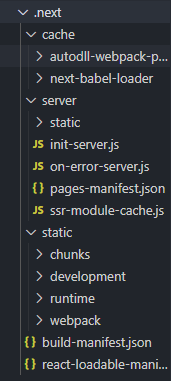

본 글은 [공식 문서](https://nextjs.org/docs/getting-started) 기준으로 작성되었습니다.

## 소개

## 설치

```sh
$ npx create-next-app 폴더명
$ npm install next react react-dom
```

정상적으로 설치 되었다면 `package.json`에 아래와 같은 scripts가 있는 걸 확인할 수 있다.

```json
"scripts": {
    "dev": "next dev",
    "build": "next build",
    "start": "next start"
},
```

`react`와 달리 생성 후 아무것도 존재하지 않는다. 그래서 폴더부터 하나씩 만들어야 한다.
`pages` 폴더에 `index.js`를 만들어보자.

폴더 구조

```
node_modules/
pages
└─ index.js
package.json
packgae-lock.json
```

`index.js`

```js
function HomePage() {
  return <div>Welcome to Next.js!</div>
}

export default HomePage
```

그 후, `npm run dev`로 서버를 돌리면 http://localhost:3000 에서 서버가 열리는 걸 볼수 있다.

```sh
$ npm run dev

ready - started server on http://localhost:3000
event - compiled successfully
event - build page: /next/dist/pages/_error
wait  - compiling...
event - compiled successfully
event - build page: /
wait  - compiling...
event - compiled successfully
```

`npm run dev`을 하면 위의 코드가 CLI창에 뜨면서 `.next`라는 폴더가 생기는 것을 볼 수 있다.

<p style="text-align: center;">
</p>

이를 통해 next.js는 자동으로 컴파일과 빌드(웹팩과 바벨로)를 진행하며 `/`에 페이지를 정적으로 페이지를 만드는 것을 확인할 수 있다.
