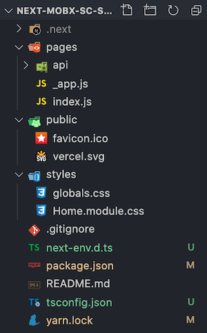
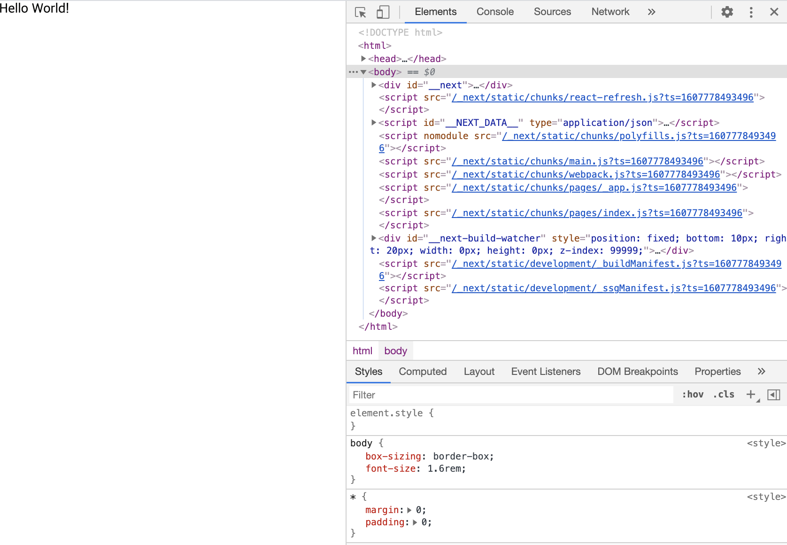
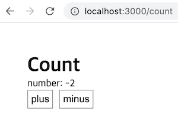
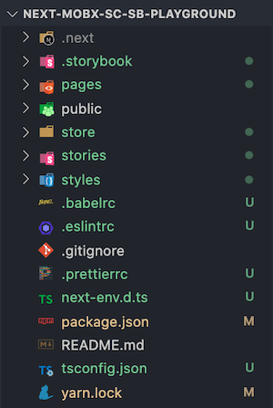
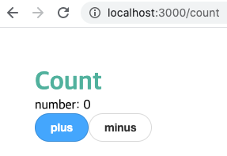

<div style="font-size: 12px; font-style: italic; text-align: right;">
마지막 업데이트: 2021.01.29
</div>

Next에 TypeScript, MobX, Styled-components, Storybook 까지 포함한 프로젝트를 세팅해보자.

Next 소개는 [이전글](https://howdy-mj.me/next/next-js-intro/)에서, 완성된 코드는 [Github](https://github.com/howdy-mj/next-ts-mobx-sc-sb-boilerplate)에서 볼 수 있다.

## 설치

```json
// 해당 프로젝트의 package.json
{
  // ...
  "dependencies": {
    "mobx": "^6.0.4",
    "mobx-react": "^7.0.5",
    "next": "^10.0.3",
    "react": "^17.0.1",
    "react-dom": "^17.0.1",
    "styled-components": "^5.2.1"
  },
  "devDependencies": {
    "@babel/core": "^7.12.10",
    "@storybook/addon-actions": "^6.1.11",
    "@storybook/addon-essentials": "^6.1.11",
    "@storybook/addon-links": "^6.1.11",
    "@storybook/react": "^6.1.11",
    "@types/node": "^14.14.12",
    "@types/react": "^17.0.0",
    "@types/styled-components": "^5.1.5",
    "@typescript-eslint/eslint-plugin": "^4.9.1",
    "@typescript-eslint/parser": "^4.9.1",
    "babel-loader": "^8.2.2",
    "babel-plugin-styled-components": "^1.12.0",
    "eslint-config-prettier": "^7.0.0",
    "eslint-plugin-prettier": "^3.2.0",
    "eslint-plugin-react": "^7.21.5",
    "prettier": "^2.2.1",
    "typescript": "^4.1.3"
  }
  // ...
}
```

### Next, TypeScript

```shell
$ yarn create-next-app # 설치 중간에 폴더명 설정
$ cd 폴더명
$ yarn add next react react-dom

# typescript 설정
$ touch tsconfig.json
$ yarn add --dev typescript @types/react @types/node
$ yarn dev
```

타입스크립트를 사용할 때 필요한 `next-env.d.ts`과 `tsconfig.json` config가 자동으로 만들어진다. 해당 파일을 삭제하면 타입에러가 뜨니 삭제하면 안된다.

<div style="text-align: center; font-size: 14px; color: gray;">

초기 폴더 구조
</div>

### ESLint, Prettier

```sh
$ yarn add -D prettier eslint-config-prettier eslint-plugin-prettier eslint-plugin-react @typescript-eslint/eslint-plugin @typescript-eslint/parser

```

root 폴더에 아래 두 개의 파일을 만든다.

<span class="file-location">.eslintrc</span>

```json
{
  "parser": "@typescript-eslint/parser",
  "extends": [
    "plugin:react/recommended",
    "plugin:@typescript-eslint/recommended",
    "prettier/@typescript-eslint",
    "plugin:prettier/recommended"
  ],
  "plugins": ["react", "@typescript-eslint", "prettier"],
  "parserOptions": {
    "ecmaVersion": 6,
    "ecmaFeatures": {
      "jsx": true
    }
  },
  "rules": {
    "prettier/prettier": ["error", { "singleQuote": true }],
    "react/jsx-uses-vars": "error"
  },
  "ignorePatterns": ["*.config.js"]
}
```

<span class="file-location">.prettierrc</span>

```json
{
  "singleQuote": true,
  "semi": true,
  "useTabs": false,
  "tabWidth": 2,
  "trailingComma": "all",
  "printWidth": 80
}
```

### Styled-components

```shell
$ yarn add styled-components
$ yarn add -D @types/styled-components babel-plugin-styled-components
```

Next는 SSR이기 때문에 styled-components의 babel 설정을 따로 해줘야 한다.

root 폴더에 `.babelrc`를 만들어서 아래와 같이 작성하자.

<span class="file-location">.babelrc</span>

```json
{
  "presets": ["next/babel"],
  "plugins": [
    [
      "styled-components",
      {
        "ssr": true,
        "displayName": true,
        "preprocess": false
      }
    ]
  ]
}
```

<details>
  <summary>🔍  <strong>development, production에 따른 babel 세팅</strong></summary>

```json
{
  "env": {
    "development": {
      "plugins": [
        [
          "babel-plugin-styled-components",
          { "ssr": true, "displayName": true, "preprocess": false }
        ]
      ],
      "presets": ["next/babel"]
    },
    "production": {
      "plugins": [
        [
          "babel-plugin-styled-components",
          { "ssr": true, "displayName": true, "preprocess": false }
        ]
      ],
      "presets": ["next/babel"]
    }
  },
  "plugins": [
    [
      "babel-plugin-styled-components",
      { "ssr": true, "displayName": true, "preprocess": false }
    ]
  ]
}
```

</details>

<br />

원래 styled-component를 쓰면 console에서 Elements를 확인할 때 className이 암호화되어 식별하기 힘들다. 하지만 `babel-plugin-styled-components`를 설치하면 컴포넌트 이름을 붙여주어 어떤 것인지 알아볼 수 있으며, 디버깅할 때도 쉽다. 이 외, debugging, minification 등의 자세한 babel 설정은 [공식 홈페이지](https://styled-components.com/docs/tooling)에서 볼 수 있다.

이제 기존 `styles` 폴더 안에 있는 것을 삭제하고, User agent sheet를 초기화 할 reset과 전역에서 사용할 theme 변수 파일을 만들어보자.

<span class="file-location">styles/reset.ts</span>

```ts
import { createGlobalStyle } from 'styled-components'

const GlobalStyle = createGlobalStyle`
  * {
    margin: 0;
    padding: 0;  
  }
  html {
    font-size: 62.5%; // 1rem = 10px; 10px/16px = 62.5%
    height: 100vh;
  }
  body {
    box-sizing: border-box;
    font-size: 1.6rem;   
  }
  a {
    &:link,
    &:visited,
    &:hover,
    &:active {
      color: inherit;
      text-decoration: inherit;
    }
  }
  input,
  select,
  button {
    -webkit-appearance: none;
    background: none;
    border: none;
    font-size: inherit;
    color: inherit;
    &:focus {
      outline: none;
    }
    &:disabled {
      cursor: not-allowed;
    }
  }
  a, button {
    cursor: pointer;
  }
  pre {
    white-space: pre-line;
  }
`

export default GlobalStyle
```

<span class="file-location">styles/theme.ts</span>

```ts
export const size = {
  pc: '75em', // 1200px
  tab: '56.25em', // 900px
  mobile: '31.25em', // 500px
  mobileS: '23.125em', // 370px
}

const theme = {
  color: {
    primary: '#344E5C',
    secondary: '#4AB19D',
    point: '#EFC958',
    black: '#000000',
    gray5: '#444444',
    gray4: '#767676',
    gray3: '#C6C6C6',
    gray2: '#E6E6E6',
    gray1: '#E5E5E5',
    gray0: '#FAFAFA',
    white: '#FFFFFF',
    success: '#22bb33',
    danger: '#bb2124',
    warning: '#f0ad4e',
    info: '#5bc0de',
  },
  window: {
    pc: `@media screen and (max-width: ${size.pc}px)`,
    tab: `@media screen and (max-width: ${size.tab}px)`,
    mobile: `@media screen and (max-width: ${size.mobile}px)`,
    mobileS: `@media screen and (max-width: ${size.mobileS}px)`,
  },
}

export default theme
```

theme에 대한 타입을 지정 후, 다시 theme에서 import 한다.

<span class="file-location">styles/styled.d.ts</span>

> 타입을 지정하는 파일의 이름은 무조건 'styled.d.ts'여야 한다. 아니면 자동완성이 뜨지 않는다.

```ts
import 'styled-components'

declare module 'styled-components' {
  export interface DefaultTheme {
    color: {
      primary: string
      secondary: string
      point: string
      black: string
      gray5: string
      gray4: string
      gray3: string
      gray2: string
      gray1: string
      gray0: string
      white: string
      success: string
      danger: string
      warning: string
      info: string
    }
    window: {
      pc: string
      tab: string
      mobile: string
      mobileS: string
    }
  }
}
```

<span class="file-location">styles/theme.ts</span>

```ts
import { DefaultTheme } from 'styled-components'
// ...
const theme: DefaultTheme = {
  //...
}
```

<span class="file-location">pages/\_document.tsx</span>

```ts
import Document, { DocumentContext } from 'next/document'
import { ServerStyleSheet } from 'styled-components'

export default class MyDocument extends Document {
  static async getInitialProps(ctx: DocumentContext) {
    const sheet = new ServerStyleSheet()
    const originalRenderPage = ctx.renderPage

    try {
      ctx.renderPage = () =>
        originalRenderPage({
          enhanceApp: App => props => sheet.collectStyles(<App {...props} />),
        })

      const initialProps = await Document.getInitialProps(ctx)
      return {
        ...initialProps,
        styles: (
          <>
            {initialProps.styles}
            {sheet.getStyleElement()}
          </>
        ),
      }
    } finally {
      sheet.seal()
    }
  }
}
```

SSR은 사용자들이 요청하면 그때 미리 만들어 놓은 HTML을 먼저 보여주어 매우 빠르다. 하지만 styled-components는 자바스크립트이기 때문에 나중에 렌더가 된다. 즉, styled-component가 완전히 로딩되기 전에 페이지가 켜지기 때문에 스타일이 적용되기 전의 화면이 먼저 보이고, 화면 깜빡인 다음에 스타일을 불러온다. 따라서 위 처럼 ServerStyleSheet를 먼저 가져와야 한다.

<span class="file-location">pages/\_app.tsx</span>

```ts
import type { AppProps } from 'next/app';
import { ThemeProvider } from 'styled-components';

import GlobalStyle from '../styles/reset';
import theme from '../styles/theme';

function MyApp({ Component, pageProps }: AppProps) {
  return (
    <ThemeProvider theme={theme}>
      <GlobalStyle />
      <Component {...pageProps} />
    </ThemeProvider>
  );
}

export default MyApp;
```

본래 global에 있는 stylesheets과의 충돌을 피하기 위해, 개인이 설정한 CSS 파일은 오직 `pages_app.tsx`에서만 import 해야 한다.

<span class="file-location">pages/index.tsx</span>

```ts
import Head from 'next/head'

export default function Home() {
  return (
    <div>
      <Head>
        <title>howdy-mj</title>
        <link rel="icon" href="/favicon.ico" />
      </Head>

      <div>Hello World!</div>
    </div>
  )
}
```

이제 `yarn dev`를 해보면 성공적으로 reset이 적용된 걸 볼 수 있다.

<div style="text-align: center; font-size: 14px; color: gray;">

Styles에서 reset에 설정한 내용 확인 가능
</div>

<br />

### MobX

```shell
$ yarn add mobx mobx-react
```

MobX 소개와 예제는 [이전글](https://howdy-mj.me/mobx/mobx6-intro/)로 대체한다.

함수형을 쓰기 때문에 별도의 Class config는 주지 않는다.

<span class="file-location">store/count.ts</span>

```ts
import { makeAutoObservable } from 'mobx'

class Count {
  number: number = 0
  constructor() {
    makeAutoObservable(this)
  }
  increase = () => {
    this.number++
  }
  decrease = () => {
    this.number--
  }
}

const countStore = new Count()
export default countStore
```

<span class="file-location">pages/count.tsx</span>

```ts
import { observer } from 'mobx-react'
import styled from 'styled-components'

import countStore from '../store/count'

const CountPage: React.FC = observer(() => {
  return (
    <div style={{ padding: '50px' }}>
      <div>
        <h1>Count</h1>
        <div>number: {countStore.number}</div>
        <Button onClick={() => countStore.increase()}>plus</Button>
        <Button onClick={() => countStore.decrease()}>minus</Button>
      </div>
    </div>
  )
})

export default CountPage

const Button = styled.button`
  border: 1px solid gray;
  padding: 5px;
  margin-right: 10px;
`
```

`yarn dev` 후, `/count`로 이동하면 정상적으로 작동하는 것을 확인할 수 있다.

<div style="text-align: center; font-size: 14px; color: gray;">

Next MobX 적용
</div>

<br />

### Storybook

```shell
$ npx sb init
```

<div style="text-align: center; font-size: 14px; color: gray;">

Storybook 설치 후, 폴더 구조
</div>

<br />

storybook을 설치하면 알아서 타입스크립트인 것을 감지하고 설정해준다. `package.json`을 가면 스토리북 관련 script가 추가된 것도 확인할 수 있다.

설치하고자 하는 라이브러리를 다 설치했으니, 폴더 구조를 다시 잡아보자.

components라는 폴더 안에 재사용될 컴포넌트와 stories 파일을 넣을 것이며, containers 폴더안 페이지 관련 코드들이 들어갈 것이다.따라서 root에 `components`, `containers` 폴더를 생성하고, `stories` 안에 있는 건 `components` 안으로 집어 넣자.

components는 storybook에 내제된 컴포넌트 들을 사용할 것이며, 이를 styled-components로 변경하는 것은 [이전 글](https://howdy-mj.me/storybook/writing-stories/)을 참고하겠다.

`components`안에 만들 Button, Header 컴포넌트 코드는 [여기](https://github.com/howdy-mj/writing-stories/tree/master/src/components)에서 볼 수 있다.

### 완성될 폴더 구조

```
.storybook
components
  ├─ Button
  │   ├─ index.stories.tsx
  │   └─ index.tsx
  └─ Header
      ├─ index.stories.tsx
      └─ index.tsx
api
containers
  └─ Count
      └─ index.tsx
pages
  ├─ _app.tsx
  ├─ _document.tsx
  ├─ count.tsx
  └─ index.tsx
public
store
styles
```

## 폴더 절대경로 설정

위에서 바꾼 폴더 구조대로, 절대 경로를 설정해보겠다.

Next는 static한 구조를 지니고 있어 React처럼 eject를 하거나 별도의 라이브러리(ex. CRACO) 없이 절대 경로 설정이 가능하다.

<span class="file-location">tsconfig.json</span>

```json
{
  "compilerOptions": {
    "baseUrl": ".",
    "paths": {
      "@api/*": ["api/*"],
      "@components/*": ["components/*"],
      "@container/*": ["container/*"],
      "@pages/*": ["pages/*"],
      "@styles/*": ["styles/*"],
      "@store/*": ["store/*"]
    }
    // ...
  }
}
```

절대 경로를 다 설정했다면, 아래의 파일들을 수정해보자.

개인의 취향이지만, 필자는 모든 로직은 `pages`가 아닌 `containers` 폴더에서 처리하기 때문에 모두 옮겼다.

<span class="file-location">pages/counts.tsx</span>

```ts
import CountContainer from '@containers/Count'

const CountPage: React.FC = () => {
  return <CountContainer />
}

export default CountPage
```

<span class="file-location">containers/Count/index.tsx</span>

```ts
import { observer } from 'mobx-react'

import countStore from '@store/count'
import { Button } from '@components/Button'
import styled from 'styled-components'

const CountContainer: React.FC = observer(() => {
  return (
    <div style={{ padding: '50px' }}>
      <div>
        <Title>Count</Title>
        <div>number: {countStore.number}</div>
        <Button label="plus" primary onClick={() => countStore.increase()} />
        <Button label="minus" onClick={() => countStore.decrease()} />
      </div>
    </div>
  )
})

export default CountContainer

const Title = styled.h1`
  color: ${props => props.theme.color.secondary};
`
```

설정을 마친 후, 다시 서버를 켜면 아래와 같은 화면이 나온다.

<div style="text-align: center; font-size: 14px; color: gray;">

</div>

<br />

완성된 코드: [Github](https://github.com/howdy-mj/next-ts-mobx-sc-sb-boilerplate)

<br />

**참고**

<div style="font-size: 12px;">

- https://nextjs.org/
- https://styled-components.com/

</div>
