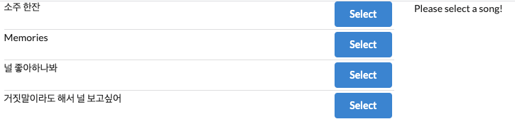
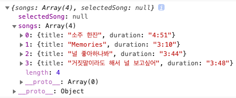
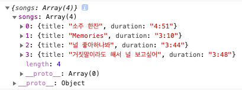
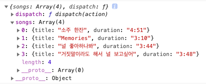
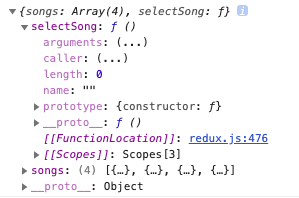
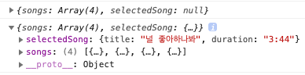
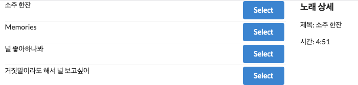

## Redux란?

React 프로젝트의 규모가 커질때마다 자식으로 넘겨주어야 하는 props의 깊이도 점점 깊어진다. 따라서, 어디에서든 내가 원하는 state를 사용할 수 있는 라이브러리 [Redux](https://redux.js.org/)가 나타났다.

_Redux는 React 뿐만 아니라, Angular, Vue, 바닐라 JS 등에서도 모두 사용가능하지만, 해당 글은 React만 다룬다_

Redux만 사용하여 React에서 사용할 수 있지만, 더 편하게 사용하기 위해 [React-Redux](https://react-redux.js.org/)가 나왔다.

## React-redux 알아보기

<div style="text-align: center; font-size: 12px; color: gray;">
  
  <p>완성 화면</p>
</div>

왼쪽의 노래 목록에서 클릭(select)한 것을 오른쪽에 띄워보는 프로젝트를 만들어보며, react-redux에 대해 알아보자. 해당 프로젝트는 [Modern React with Redux (Udemy)](https://www.udemy.com/course/react-redux/)의 내용을 토대로 만들었다.

<br />

### 세팅

```shell
$ create-react-app songs
$ cd songs
$ npm install redux react-redux
```

`src`안의 내용을 전부 삭제 후, 밑의 구조처럼 폴더와 파일을 생성한다.

```
src
├─ actions
├─ components
├─ reducers
└─ index.js
```

`src/index.js`

```js
import React from 'react'
import ReactDOM from 'react-dom'
import App from './components/App'

ReactDOM.render(<App />, document.querySelector('#root'))
```

`src/components/App.js`

```js
import React from 'react'

const App = () => {
  return <div>App</div>
}

export default App
```

그리고 스타일링에 신경쓰지 않기 위해 `public/index.html`에 [Semantic-ui](https://cdnjs.com/libraries/semantic-ui)를 추가한다.

```html
<!-- ... -->
<head>
  <link
    rel="stylesheet"
    href="https://cdnjs.cloudflare.com/ajax/libs/semantic-ui/2.4.1/semantic.min.css"
  />
</head>
<!-- ... -->
```

<br />

### action creator, reducer 생성

본격적으로 리덕스로 상태관리를 하기 위해 먼저 action creators를 만든다.

`src/actions/index.js`

```js
// action creator
export const selectSong = song => {
  // return an action
  return {
    type: 'SONG_SELECTED',
    payload: song,
  }
}
```

`src/reducers/index.js`

```js
// 노래 목록을 알려주는 reducer
const songsReducer = () => {
  // 아무것도 바꾸지 않기 때문에 어떠한 argument도 없음
  return [
    { title: '소주 한잔', duration: '4:51' },
    { title: 'Memories', duration: '3:10' },
    { title: '널 좋아하나봐', duration: '3:44' },
    { title: '거짓말이라도 해서 널 보고싶어', duration: '3:48' },
  ]
}

// 선택된 노래를 알려주는 reducer
const selectedSongReducer = (selectedSong = null, action) => {
  // 선택된 노래의 초기값을 null로 두고, action을 가져오기 위해 인자로 받아 옴
  if (action.type === 'SONG_SELECTED') {
    return action.payload
  }
  return selectedSong
}
```

그 후, 만든 action creator와 reducers를 `src/index.js`에게 알려주어 전역에 뿌려야 한다.

그러기 위해서 우선 reducer를 하나로 묶어 준다.

`src/reducers/index.js`

```js
import { combineReducers } from 'redux'

// 노래 목록을 알려주는 reducer
const songsReducer = () => {
  // 아무것도 바꾸지 않기 때문에 어떠한 argument도 없음
  return [
    { title: '소주 한잔', duration: '4:51' },
    { title: 'Memories', duration: '3:10' },
    { title: '널 좋아하나봐', duration: '3:44' },
    { title: '거짓말이라도 해서 널 보고싶어', duration: '3:48' },
  ]
}

// 선택된 노래를 알려주는 reducer
const selectedSongReducer = (selectedSong = null, action) => {
  // 에러 방지를 위해 selectedSong의 초기값을 null로,
  // action을 가져오기 위해 인자로 받아 옴
  if (action.type === 'SONG_SELECTED') {
    return action.payload
  }

  return selectedSong
}

export default combineReducers({
  songs: songsReducer,
  selectedSong: selectedSongReducer,
})
```

<br />

### 전역에서 state 가져오기

`src/index.js`

```js
import React from 'react'
import ReactDOM from 'react-dom'
import { Provider } from 'react-redux'
import { createStore } from 'redux'
import App from './components/App'
import reducers from './reducers'

const store = createStore(reducers)
// 생성한 store안에 모든 전역 state를 넣어 관리

ReactDOM.render(
  <Provider store={store}>
    // 전역에서 사용가능하도록 App.js를 감싸준다
    <App />
  </Provider>,
  document.querySelector('#root')
)
```

노래 목록을 볼 수 있는 components를 만들고, `App.js`에서 불러온다.

`src/components/SongList.js`

```js
import React from 'react'

const SongList = () => {
  return <div>SongList</div>
}

export default SongList
```

`src/components/App.js`

```js
import React from 'react'
import SongList from './SongList'

const App = () => {
  return (
    <div>
      <SongList />
    </div>
  )
}

export default App
```

<br />

### connect()() 이해하기

이제 store로 뿌려준 state가 전역에서 잘 나타나는지 확인해 보면 된다. 이때 store와 해당 state를 사용하고 싶은 컴포넌트에서 `connect`를 사용하여 확인할 수 있다. connect는 그 안의 return 값을 반환한다.

```js
function connect() {
  return function() {
    return '하우디엠제이'
  }
}
```

만약 위와 같은 connect함수가 있을 때, 호출하면 아래와 같은 결과가 나온다.

```js
connect() // output: f()
connect()() // output: '하우디엠제이'
```

위와 같은 원리로, 내가 가져오고 싶은 components에서도 아래처럼 connect로 감싸주어야 한다.

`src/components/SongList.js`

```js{11}
import React from 'react'
import { connect } from 'react-redux'

const SongList = () => {
  return <div>SongList</div>
}

const mapStateToProps = state => {
  // getState와 같은 이름으로 지어도 되지만,
  // 관행상 mapStateToProps를 사용한다
  console.log(state)
  return state
}

export default connect(mapStateToProps)(SongList)
```

위처럼 작성했다면, 아래와 같은 console 화면이 뜬다.

<div style="text-align: center; font-size: 12px; color: gray;">
  
  <p>SongList - console.log(state)</p>
</div>

정상적으로 state를 가져오는 것을 확인할 수 있다.
위의 이미지에서 확인할 수 있듯이, state가 객체에 한번 감싸져 온다.
비구조화 할당을 통해 바로 꺼낼 수 있도록 가져오자.

```js{4}
// src/components/SongList.js
// ...
const mapStateToProps = state => {
  console.log({ songs: state.songs })
  return { songs: state.songs }
}
```

<div style="text-align: center; font-size: 12px; color: gray;">
  
  <p>SongList - console.log({ songs: state.songs })</p>
</div>

그리고 이제 컴포넌트 안에서도 props로 제대로 가져오고 있는지 확인해보자.

```js{4}
// src/components/SongList.js
// ...
const SongList = props => {
  console.log(props)
  return <div>SongList</div>
}

const mapStateToProps = state => {
  return { songs: state.songs }
}
```

<div style="text-align: center; font-size: 12px; color: gray;">
  
  <p>SongList - console.log(props)</p>
</div>

보면 `dispatch()`도 같이 가져오는 것을 확인할 수 있다.

이제 가져온 props로 화면을 구성해보자.

`src/components/SongList.js`

```js
// ...
const SongList = props => {
  const renderList = () => {
    return props.songs.map(song => {
      return (
        <div className="item" key={song.title}>
          <div className="right floated content">
            <button className="ui button primary">Select</button>
          </div>
          <div className="content">{song.title}</div>
        </div>
      )
    })
  }
  return <div className="ui divided list">{renderList()}</div>
}
```

`src/components/App.js`

```js
// ...
const App = () => {
  return (
    <div className="ui container grid">
      <div className="ui row">
        <div className="column eight wide">
          <SongList />
        </div>
      </div>
    </div>
  )
}
```

<div style="text-align: center; font-size: 12px; color: gray;">
  
  <p>SongList 화면</p>
</div>

<br />

### action creator 동작

이제 오른쪽 Select 버튼을 눌렀을 때, 실제로 리덕스에 반영하기 위해 행동을 취해주는 action creator를 가져오자. 이때 가져온 action creator는 `connect()`의 두 번째 인자에 작성한다.

`src/components/SongList.js`

```js{26,27,28}
import React from 'react'
import { connect } from 'react-redux'
import { selectSong } from '../actions'

const SongList = props => {
  console.log(props) // 잘 들어왔는지 확인
  const renderList = () => {
    return props.songs.map(song => {
      return (
        <div className="item" key={song.title}>
          <div className="right floated content">
            <button className="ui button primary">Select</button>
          </div>
          <div className="content">{song.title}</div>
        </div>
      )
    })
  }
  return <div className="ui divided list">{renderList()}</div>
}

const mapStateToProps = state => {
  return { songs: state.songs }
}

export default connect(mapStateToProps, {
  selectSong, // selectSong: selectSong과 같은 것
})(SongList)
```

찍어본 console을 보면,

<div style="text-align: center; font-size: 12px; color: gray;">
  
  <p>SongList - console.log(props)</p>
</div>

아무것도 없었던 `dispatch()`가 `selectSong()`으로 바뀐 것을 확인할 수 있다. 이제 button에 onClick 함수를 추가하여 제대로 동작하는지 확인해보자.

`src/components/SongList.js`

```js{10}
// ...
const SongList = props => {
  const renderList = () => {
    return props.songs.map(song => {
      return (
        <div className="item" key={song.title}>
          <div className="right floated content">
            <button
              className="ui button primary"
              onClick={() => props.selectSong(song)}
            >
              Select
            </button>
          </div>
          <div className="content">{song.title}</div>
        </div>
      )
    })
  }
  return <div className="ui divided list">{renderList()}</div>
}

const mapStateToProps = state => {
  console.log(state) // selectSong이 잘 동작하는지 확인
  return { songs: state.songs }
}

export default connect(mapStateToProps, { selectSong })(SongList)
```

위의 코드 추가 후, 아무 Select 버튼을 클릭하면 선택된 것을 console 창에서 확인할 수 있다.

<div style="text-align: center; font-size: 12px; color: gray;">
  
  <p>SongList - selectSong 동작</p>
</div>

<br />

#### 왜 action creator는 import하고 바로 사용하지 못할까?

분명 위에 `import { selectSong } from '../actions'`를 했는데도 왜 다시 `export default connect(mapStateToProps, { selectSong })(SongList)`에 작성해야 하는가라는 의문이 있었다.

그 이유는, 만약 위에서 import한 action creator를 해당 컴포넌트 내부에서 바로 사용하게 되면, 만든 action creator의 object가 실행될 뿐, 리액트는 이것을 dispatch로 실행해야하는지 감지하지 못한다.

```js{12}
// src/components/SongList.js
// 리액트가 selectedSong을 일반 함수로 착각하여
// dispatch로 실행하지 못함
const SongList = props => {
  const renderList = () => {
    return props.songs.map(song => {
      return (
        <div className="item" key={song.title}>
          <div className="right floated content">
            <button
              className="ui button primary"
              onClick={() => selectSong(song)}
            >
              Select
            </button>
          </div>
          <div className="content">{song.title}</div>
        </div>
      )
    })
  }
  return <div className="ui divided list">{renderList()}</div>
}
// ... 생략
export default connect(mapStateToProps)(SongList)
```

위 처럼 일반 함수로 사용한다면, 리액트는 이를 감지하지 못하여 store에도 아무런 변화가 없다.

<br />

### SongDetail 구현

`src/components/SongDetail.js`

```js{8}
import React from 'react'
import { connect } from 'react-redux'

const SongDetail = ({ selectedSong }) => {
  // 비구조화 할당으로 {selectedSong}만 가져오기
  // 원래는 props로 가져온다면,
  // props.selectedSong.title, props.selectedSong.duration으로 작성
  console.log(selectedSong)
  return <div>Please select a song!</div>
}

const mapStateToProps = state => {
  // selectedSong이란 이름으로 선택된 노래 가져오기
  return { selectedSong: state.selectedSong }
}

export default connect(mapStateToProps)(SongDetail)
```

`src/components/App.js`

```js
import React from 'react'
import SongList from './SongList'
import SongDetail from './SongDetail'

const App = () => {
  return (
    <div className="ui container grid">
      <div className="ui row">
        <div className="column eight wide">
          <SongList />
        </div>
        <div className="column eight wide">
          <SongDetail />
        </div>
      </div>
    </div>
  )
}

export default App
```

console을 확인해보면, 처음에는 `null`이었다가, select 누른 노래가 console 창에 뜨는 걸 확인할 수 있다.

이제 `selectedSong`이 있을 때, 화면에 나타나게 해보자.

```js
// src/components/SongDetail.js
// ...
const SongDetail = ({ selectedSong }) => {
  return (
    <>
      {!selectedSong ? (
        // 선택한 곡이 없을 때 화면
        <div>Please select a song!</div>
      ) : (
        // 선택한 곡이 있을 때 화면
        <div>
          <h3>노래 상세</h3>
          <p>제목: {selectedSong.title}</p>
          <p>시간: {selectedSong.duration}</p>
        </div>
      )}
    </>
  )
}
// ...
```

<div style="text-align: center; font-size: 12px; color: gray;">
  
  <p>SongDetail 동작</p>
</div>

정상적으로 화면에 구현되는 것을 확인할 수 있다.

완성 코드: [songs-react-redux](https://github.com/howdy-mj/songs-react-redux)
