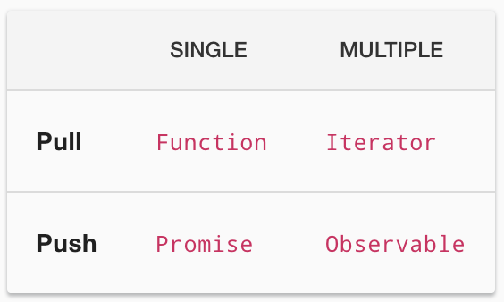

<div class="intro">
  <p>해당 글은 Angular를 사용하면서 반응형 프로그래밍, RxJS에 대해 궁금한 것을 작성한 글입니다.</p>
  <p>오역이 있을 수 있습니다. 피드백은 언제나 환영합니다:)</p>
</div>

<br />

대부분 어플리케이션에는 비동기 작업 처리가 필수다. 그리고 그 어플리케이션의 규모가 커지면서 많은 양의 데이터를 처리해야 하는데, 데이터를 가공하고 올바른 시점에 데이터를 반환하게 하기 위해 코드가 점점 더 복잡해질 수 있다.

이런 복잡한 데이터를 처리하기 위해 <span class="definition">반응형 프로그래밍(Reactive Programming)</span>이 등장하였다.

## 반응형 프로그래밍(Reactive Programming)

<a href="https://en.wikipedia.org/wiki/Reactive_programming" target="_blank">위키피디아</a>에서 반응형 프로그래밍은 데이터 스트림과 변화의 전파(propagation of change)와 관련된 <span class="definition">선언형 프로그래밍(Declarative Programming) 패러다임</span>이다. 해당 패러다임으로 정적(ex. arrays), 동적(ex. 이벤트 이미터) 데이터 스트림을 쉽게 표현할 수 있으며, 변경된 데이터의 흐름 전달이 용이하다.

데이터 스트림은 키 입력, 마우스, 터치, HTTP 호출 등의 이벤트를 뜻한다. 그리고 <span class="definition">명령형 프로그래밍(Imperative Programming)</span>이 어떤 방식으로 하는지(How)에 알려준다면, <span class="definition">선언형 프로그래밍(Declarative Programming)</span>은 무엇(What)과 같은지를 반환하여, 반응형 프로그래밍은 데이터가 어떤 값으로 변경되는지 직관적으로 보여준다.

간단한 수식으로 명령형 프로그래밍과 반응형 프로그래밍을 비교해 보자.

```js
// 명령형 프로그래밍
let b = 1
let c = 2
let a = b + c
console.log(a) // 3
b = 10
console.log(a) // 3 ('=' 연산자 이전의 b, c 값으로 a를 반환)

// 반응형 프로그래밍
// '$'는 참조되는 값이 변경되면 실시간으로 해당 값을 따른다
let b = 1
let c = 2
let a$ = b + c
console.log(a$) // 3
b = 10
c = 5
console.log(a$) // 15 ('=' 연산자 이후에 변경된 b, c 값으로 a를 반환)
```

반응형 프로그래밍에서 `$`는 스트림을 가리키는 변수를 한정하는 데 사용하며, 변경 된 값을 실시간으로 참조한다.

<br />

RxJS의 컨트리뷰터 <a href="https://gist.github.com/staltz/868e7e9bc2a7b8c1f754" target="_blank">André Staltz</a>는 <span class="variable bold">Reactive programming is programming with asynchronous data streams</span>, 즉 반응형 프로그래밍을 비동기 데이터 스트림을 이용한 프로그래밍이라 정의했다.

그리고 <a href="http://reactivex.io" target="_blank">Reactive eXtension (Rx)</a>은 옵저버블 스트림을 사용하는 비동기 프로그래밍용 API(<span class="variable">An API for asynchronous programming
with observable streams</span>)라고 정의하고 있다.

## 옵저버블(Observable)

Rx를 설명하는데 가장 핵심이 되는 단어가 바로 <span class="definition">옵저버블(Observable)</span>인데, 공식문서에서 이를 여러 개의 값을 Push하는 것으로 정의하고 있다.

<div class="img-div" style="width: 300px;">
  
  <p>https://rxjs-dev.firebaseapp.com/guide/observable</p>
</div>

### Pull vs. Push

Pull과 Push는 두개의 다른 프로토콜로, <span class="definition">데이터 생산자(Data Producer)</span>와 <span class="definition">데이터 소비자(Data Consumer)</span>가 통신하는 방법을 제공한다.

처음에는 데이터 생산자가 서버, 데이터 소비자가 클라이언트인줄 알았다. 하지만 Rx 내에서 말하는 생산자는 <span class="underline">데이터 변경을 수행하는 이벤트</span>, 소비자는 <span class="underline">데이터 변경 이벤트를 처리하는 것</span>이다.

|          |                    생산자                    |               소비자                |
| :------: | :------------------------------------------: | :---------------------------------: |
| **Pull** |       Passive: 요청이 올때 데이터 생산       | Active: 데이터가 언제 요청될지 결정 |
| **Push** | Active: 데이터를 자신의 페이스(phase)에 생산 |     Passive: 받은 데이터에 반응     |

<div class="explain">
  <p>* Pull은 function, iterator를 Push는 Promise, Observable을 말한다.</p>
  <p>* Passive는 이벤트를 기다리는 수동적인 상태, Active는 이벤트를 발동시키는 능동적인 상태를 나타내는 것으로 추측한다.</p>
</div>

<br />

#### Pull

Pull은 소비자가 언제 생산자에서 데이터를 받아올지 결정한다. 생산자는 언제 소비자에게 데이터를 전달해야 하는지 모른다.

자바스크립트의 모든 함수는 Pull 시스템에 해당한다. 함수는 데이터의 생산자이며, 함수를 호출하는 코드는 단일 반환 값을 '꺼냄'으로써 데이터를 소비한다.

ES2015에서 소개 된 제너레이터 함수와 이터레이터(<span class="return">function\*</span>) 역시 pull에 해당한다. <span class="return">iterator.next()</span>은 소비자로 여러 개의 값을 iterator(생산자)에서 '꺼낸다'.

어떠한 조건 혹은 소비자 값에 따라 이벤트가 발동(active) 되며, 이 때 생산자를 호출(passive)한다.

#### Push

Push는 생산자가 언제 소비자에게 데이터를 보낼지 결정하며, 소비자는 언제 데이터를 받을지 모른다.

Promise는 자바스크립트에서 가장 많이 쓰이는 Push 시스템이다. Promise(생산자)는 callback(소비자)에서 나온 값을 전달하고, function과 다르게 정확히 언제 해당 callback 값을 보낼지 결정한다.

RxJS에서는 옵저버블(Observable)이라는 새로운 Push를 내보였다. 옵저버블은 여러 값의 생산자로 값들을 옵저버(Observer, 소비자)에게 보낸다.

생산자가 변화를 감지하고 이벤트를 발동(active)시키며, 이벤트 처리는 소비자(passive)에게 맡긴다. 이때 데이터 스트림은 생산자에서 소비자로만 이동하며 다른 방향으로 이동하지 않는다. 즉, RxJS와 관련된 스트림은 항상 업스트림 옵저버블에서 다운스트림 옵저버로 흐른다.

### 정리

- <span class="return bold">Function</span>은 호출 시 단일 값을 동기적으로 반환한다.
- <span class="return bold">Iterator</span>는 반복(iteration) 시 0에서 (잠재적으로) 무한 값을 동기적으로 반환한다.
- <span class="return bold">Promise</span>는 단일 값을 반환할 수 있는(혹은 반환하지 않을 수 있는) 계산이다.
- <span class="return bold">Observable</span>은 동기 또는 비동기적으로 호출될 때부터 0에서 (잠재적으로) 무한대의 값을 반환할 수 있다.

즉, 옵저버블은 서버가 클라이언트에게 데이터를 보내주며 해당 값을 UI 단에 실시간으로 반영할 수 있게 도와준다.

## Promise vs. Observable

RxJS를 써보지 않은 상태에서 위의 내용만 봤을 때, Promise와 Observable이 얼마나 다른지 와닿지 않는다. 본 글에서는 간략히 작동 방식만 알아보고, 다음 글에서 사용한 메서드들을 자세히 다룰 예정이다.

- 옵저버블은 명시적으로 구독하기 전까지는 실행되지 않지만, Promise는 객체를 생성할 때 바로 실행된다. 데이터를 받는 쪽에서 원하는 시점을 결정하는 경우엔 옵저버블이 더 효율적이다.

```js
// Promise
// 최초 실행
let promise =
  new Promise() <
  number >
  ((resolve, reject) => {
    // ...
  })
promise.then(value => {
  // 결과 처리
})
```

```js
// 선언
const observable =
  new Observable() <
  number >
  (observer => {
    // ...
  })

// 최초 실행
observable.subscribe(value => {
  // observer 처리
})
```

- 옵저버블은 데이터를 여러 개 보낼 수 있지만, Promise는 하나만 보낼 수 있다. 데이터를 여러번 나눠서 보내는 경우라면 옵저버블이 더 효율적이다.

- 옵저버블은 체이닝과 구독을 구별하지만, Promise는 .then() 하나로 사용한다. 다른 곳에서 데이터를 복잡하게 가공해야 한다면 옵저버블이 더 효율적이다.

- 옵저버블에서 제공하는 subscribe()는 에러도 함께 처리할 수 있다. Promise는 .catch()를 사용하는 위치에 따라 에러를 처리하는 로직이 달라져야 하지만, 옵저버블은 에러 처리 로직을 한 군데에 집중할 수 있다.

## 번외) 함수형 프로그래밍과 이터레이터 패턴

Rx 공식문서에서 'Rx는 옵저버 패턴, 이터레이터 패턴 그리고 함수형 프로그래밍을 조합하여 이벤트 시퀀스를 이상적으로 관리할 수 있다'고 정의하고 있다.

> ReactiveX combines the Observer pattern with the Iterator pattern and functional programming with collections to fill the need for an ideal way of managing sequences of events.

옵저버 패턴은 객체의 상태 변화를 관찰하는 옵저버들의 목록을 객체에 등록하여 상태 변화가 있을 때마다 메서드 등을 통해 객체가 직접 목록의 각 옵저버에게 통지하도록 하는 디자인 패턴이다.

이터레이터 패턴은 객체 지향 프로그래밍에서 반복자(iterator)를 사용하여 내부에 있는 요소들을 노출시키지 않고 접근하는 디자인 패턴이다.

### 함수형 프로그래밍(Functional Programming)

RxJS는 FP와 RP의 패러다임을 결헙하면서 다음과 같은 문제를 해결하는데 도움을 줄 수 있다.

- 비동기 함수가 있는 친숙한 제어 흐름 구조(for, while등 반복문)들은 비동기를 인식하지 못하여 제대로 작동하지 않는다. 즉, 이들 구조는 반복 사이의 지연 시간 또는 대기 시간을 인식하지 못한다.
- 각 콜백 내에서 try/catch 블록이 중첩되면 에러 처리 전략이 금방 복잡해진다.
- 비즈니스 로직은 지원해야 하는 중첩된 콜백 구조 안에서 밀접하게 결합될 수 있다.
- 이벤트 또는 장기 실행 작업이 멋대로 작동하거나 취소해야 할 때, 미리 정한 시간이 지나면 이벤트를 취소할 숭 ㅣㅆ는 메커니즘을 둘 수 있다.
- 스로틀링, 디바운싱을 사용하여 전반적인 프로그램 안정성을 준다.
- 자바스크립트 애플리케이션은 메모리 관리를 걱정하지 않아도 되지만, 점차 ui가 더 커지고 풍부해지면서 이벤트 리스너들이 메모리 누수를 일으키고 브라우저 프로세스의 크기가 커지고 있는데, 이를 제어할 수 있다.

--

옵저버블은 구독되기 전까지 동작하지 않는데, 이러한 특성을 갖는 옵저버블을 cold observable이라 한다. rxjs의 옵저버블은 기본적으로 cold observable이다. 이는 구독되기 전에는 데이터 스트림을 방출(emit)하지 않으며 구독하면 처음부터 동작하기 시작한다. 따라서 옵저버는 옵저버블이 방출하는 모든 데이터 스트림을 빠짐없이 처음부터 받을 수 있다.

---

<br />

**참고**

<div style="font-size: 12px;">

- http://reactivex.io/

- https://rxjs-dev.firebaseapp.com/guide/overview

- https://thebook.io/006934/part01/ch01/04/03-02/

- https://feel5ny.github.io/2018/03/25/angular_observable/

- https://poiemaweb.com/angular-rxjs-observable

- https://angular.kr/guide/comparing-observables

- https://developers.redhat.com/blog/2017/06/30/5-things-to-know-about-reactive-programming/

<!-- - https://tech.kakao.com/2017/01/09/daummovie-rxjs/ -->

<!-- - https://www.uwanttolearn.com/android/pull-vs-push-imperative-vs-reactive-reactive-programming-android-rxjava2-hell-part2/ -->

<!-- 잘못 된 글인것 같음 -->
<!-- - https://blog.naver.com/jdub7138/220983291803 -->

<!-- RxJs 사용법 -->
<!-- - https://m.blog.naver.com/PostView.nhn?blogId=bkcaller&logNo=221627461671&proxyReferer=https:%2F%2Fwww.google.com%2F -->

</div>
