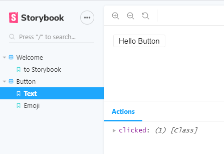

해당 글의 모든 예시는 기본으로 설치되어 있는 `src/storeis/1-Button.stories.js`에서 추가하는 형태로 진행하겠다.

## Actions

- [Actions repo](https://github.com/storybookjs/storybook/tree/master/addons/actions)
- [Actions 소개 및 설치](https://howdy-mj.netlify.app/storybook/02-addon-intro/#actions)

<br>

```js{2, 10, 15}
import React from 'react'
import { action } from '@storybook/addon-actions'
import { Button } from '@storybook/react/demo'

export default {
  title: 'Button',
  component: Button,
}

export const Text = () => (
  <Button onClick={action('clicked')}>Hello Button</Button>
)

export const Emoji = () => (
  <Button onClick={action('clicked')}>
    <span role="img" aria-label="so cool">
      😀 😎 👍 💯
    </span>
  </Button>
)
```

Actions은 간단하다.
`actions`을 import하고, `onClick()`메소드에 넣어주면 된다.



`onClick()`메소드가 있는 곳을 클릭하면 하단 Actions 탭에 'clicked'라는 이름으로 뜨는 것을 볼 수 있다.
