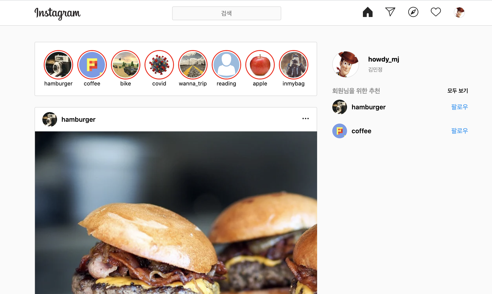
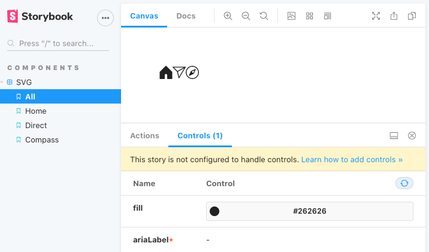

<p style="font-style: italic;">해당 글은 React 16.3, Storybook 6.0을 기준으로 작성되었습니다.</p>

## CRA, TypeScript, Styled-components 그리고 Storybook으로 인스타 클론하기

스토리북은 디자인 시스템을 만들 때 주로 사용된다고 알려져있다. 하지만 이 외, 우리가 보려는 화면을 스토리북에 적용하면 컴포넌트 별로 문서화도 쉽게할 수 있다. 따라서 누가 봐도 쉽게 알 수 있다.

### 프로젝트 소개

인스타그램 웹을 클론하면서 중복되는 요소들은 최대한 추상화하며, 이를 Storybook으로 구축하는 것이 목표다. 비즈니스 로직, 반응형은 다루지 않았으며 추후 다른 글로 작성할 수도 있다.

만들어질 화면은 아래와 같으며, 전체 코드는 [howdy-mj/insta-clone](https://github.com/howdy-mj/insta-clone)서 확인 가능하다.

사용한 것: yarn(npm도 가능), React, TypeScript, Styled-components, Storybook,

---

```shell
$ yarn create react-app insta-clone --template typescript
$ cd insta-clone

$ npx sb init
$ yarn storybook
```

아래와 같은 화면이 뜨면 정상적으로 설치된 것이다.

<div style="text-align: center; font-size: 12px;">
 
 <p>localhost:6006이 기본 포트</p>
</div>

그리고 만들어진 기본 폴더 구조는 아래와 같다.

<div style="text-align: center; font-size: 12px;">
 
 <p>초기 세팅한 폴더 구조</p>
</div>

## 1. 초기세팅

우선 `src` 폴더에는 `stories` 폴더와 `App.tsx`, `index.tsx`를 제외하고 모두 제거하자.

`src/index.tsx`

```ts
import React from 'react'
import ReactDOM from 'react-dom'
import App from './App'

ReactDOM.render(
  <React.StrictMode>
    <App />
  </React.StrictMode>,
  document.getElementById('root')
)
```

`src/App.tsx`

```ts
import React from 'react'

function App() {
  return <div>App</div>
}

export default App
```

### ESLint, Prettier

코드 문법 확인 및 정리를 위해 VSCoded에 ESLint, Prettier-Code formatter를 설치한 후, 프로젝트 최상단 root에 `.prettierrc`를 설정해 준다.

`.prettierrc`

```js
{
  "singleQuote": true,
  "semi": true,
  "useTabs": false,
  "tabWidth": 2
}
```

### Styled-components, Global 설정

```shell
$ yarn add styled-components @types/styled-components
```

브라우저의 기본 CSS 스타일(User Agent Stylesheet)를 제거해주기 위해 src 안에 styles 폴더를 생성 후, `global.ts` 파일을 생성하고 `index.tsx`에서 import 한다.

`src/styles/global.ts`

```ts
import { createGlobalStyle } from 'styled-components'

const GlobalStyle = createGlobalStyle`
  * {
    margin: 0;
    padding: 0;  
  }

  html {
    font-size: 62.5% /* 1rem = 10px */
  }

  body {
    box-sizing: border-box;
    /* 인스타그램 웹의 font style 적용 */
    font-size: 1.4rem;
    font-family: -apple-system, BlinkMacSystemFont, 'Segoe UI', Roboto, Oxygen, Ubuntu, Cantarell, 'Open Sans', 'Helvetica Neue', sans-serif;
    line-height: 1.8rem;
  }
`

export default GlobalStyle
```

추가로 다른 스타일 변수를 넣어주기 위해 `src.styles/theme.ts`도 만들어 준다.

```ts
const theme = {
  text: {
    color: 'red', // 임의로 만들어줌
  },
}
export default theme
```

`src/index.tsx`

```ts
import React from 'react'
import ReactDOM from 'react-dom'
import App from './App'
import { ThemeProvider } from 'styled-components'
import theme from './styles/theme'
import GlobalStyle from '~styles/global'
/// <reference types="styled-components/cssprop" />
/** 타입스크립트에서 css props를 쓸 때 타입 에러를 없애 줌*/
/** 슬래시(/) 3개 모두 작성*/

ReactDOM.render(
  <ThemeProvider theme={theme}>
    <App />
    <GlobalStyle />
  </ThemeProvider>,
  document.getElementById('root')
)
```

이제 `yarn start`를 해보면 개발자도구에서 정상적으로 적용된 것을 볼 수 있다.

<div style="text-align: center; font-size: 12px;">
 
 <p>스타일링 적용된 화면</p>
</div>

수정한 코드: [Github - 초기세팅](https://github.com/howdy-mj/insta-clone/commit/cd71418b3a75a5ae9582bbf933d7c863d5fa44ac)

## 2. 화면 클론하기

다시 한 번 적자면, 해당 프로젝트는 컴포넌트들의 추상화 그리고 Storybook으로 구축하는 것을 중점에 둔다. 때문에 인스타 화면과 완전히 똑같지 않으며, 페이지네이션, 책갈피, 좋아요, 댓글 등 기능은 없다.

프로젝트 개발과 글 작성을 동시에 하기 때문에 중간에 어떤 것이 추가/삭제되거나 뒤에서 다시 전면 수정될 수 있다.

<div style="text-align: center; font-size: 12px;">
 
 <p>퍼블리싱 화면</p>
</div>

수정한 코드: [Github - 화면 클론](https://github.com/howdy-mj/insta-clone/commit/e3869369ced5331ef523b8985370cec6534b41de)

클론한 코드는 모두 `Clone.tsx`에 작성했으며, 공통된 스타일은 `styles/theme.ts`에 작성했다. 불러오는 데이터는 `public/data` 안에 json으로 생성, 아이콘은 `components/svg.tsx` 안에 모아놨다. 해당 프로젝트에서 사용하는 모든 이미지는 이미지 주소를 복사하여 사용했기 때문에 언제든 없어질 수 있음을 미리 알린다.

그럼 이제 중복되는 컴포넌트를 묶어주고, Storybook에 적용하는 걸 해보자.

## 3. 추상화

우선 SVG을 추상화하고 Storybook으로 만들어 보자.

_(기존의 `svg.tsx`를 `allSvg.tsx`로 바꾼다)_

### SVG 추상화

components 폴더 안에 svg 폴더를 만들고 `allSvg.tsx`를 옮긴다. 그리고 곳에 `Svg.tsx`도 만든다.

`src/components/svg/Svg.tsx`

```ts
import React, { FC } from 'react'

export interface SvgProps {
  ariaLabel: string
  fill?: string
  height?: string | number
  width?: string | number
  viewBox?: string
  d: string
  clipRule?: string
  fillRule?: 'nonzero' | 'evenodd' | 'inherit' | undefined
}

/**
 * SVG 컴포넌트
 */
export const SVG: FC<SvgProps> = ({
  // 공통으로 사용되는 값은 default로 설정
  ariaLabel,
  fill = '#262626',
  height = '22',
  width = '22',
  viewBox = '0 0 48 48',
  d,
  clipRule,
  fillRule,
  ...props
}) => {
  return (
    <svg
      aria-label={ariaLabel}
      fill={fill}
      height={height}
      width={width}
      viewBox={viewBox}
      {...props}
    >
      <path d={d} clipRule={clipRule} fillRule={fillRule} />
    </svg>
  )
}

// 주의: export default SVG로 할 경우, 스토리북에서 props table이 나오지 않는다.
```

그 후, 기존에 `allSvg.tsx`에 있던 것도 모두 위의 컴포넌트로 대체한다. (OptionSVG는 하지 않음)

```ts
import React from 'react'
import { SVG } from './Svg'

export const HomeSVG = () => (
  <SVG
    ariaLabel="홈"
    d="M45.5 48H30.1c-.8 0-1.5-.7-1.5-1.5V34.2c0-2.6-2.1-4.6-4.6-4.6s-4.6 2.1-4.6 4.6v12.3c0 .8-.7 1.5-1.5 1.5H2.5c-.8 0-1.5-.7-1.5-1.5V23c0-.4.2-.8.4-1.1L22.9.4c.6-.6 1.6-.6 2.1 0l21.5 21.5c.3.3.4.7.4 1.1v23.5c.1.8-.6 1.5-1.4 1.5z"
  />
)

// ...

export const CompassSVG = () => (
  <SVG
    ariaLabel="사람 찾기"
    d="M24 0C10.8 0 0 10.8 0 24s10.8 24 24 24 24-10.8 24-24S37.2 0 24 0zm0 45C12.4 45 3 35.6 3 24S12.4 3 24 3s21 9.4 21 21-9.4 21-21 21zm10.2-33.2l-14.8 7c-.3.1-.6.4-.7.7l-7 14.8c-.3.6-.2 1.3.3 1.7.3.3.7.4 1.1.4.2 0 .4 0 .6-.1l14.8-7c.3-.1.6-.4.7-.7l7-14.8c.3-.6.2-1.3-.3-1.7-.4-.5-1.1-.6-1.7-.3zm-7.4 15l-5.5-5.5 10.5-5-5 10.5z"
    clipRule="evenodd"
    fillRule="evenodd"
  />
)

// ... 생략
```

localhost:3000에서 정상적으로 작동하는 것을 볼 수 있다.

<br />

### SVG 스토리북 적용

그리고 이제 `src/stories` 안에 있는걸 다 삭제하고, Svg 스토리북을 만들어 보자.

`src/stories/Svg.stories.tsx`

```ts
import React from 'react'
import { Story, Meta } from '@storybook/react/types-6-0'
import { SVG, SvgProps } from '../components/svg/Svg'

export default {
  title: 'Components/SVG', // '대분류/소분류'
  component: SVG,
  argTypes: {
    fill: { control: 'color' },
    // 스토리북에서 색상을 변경하기 쉽도록 설정
  },
} as Meta

const SvgTemplate: Story<SvgProps> = args => <SVG {...args} />
// default 값을 Template에 작성
SvgTemplate.args = {
  fill: '#262626',
  height: 22,
  width: 22,
  viewBox: '0 0 48 48',
}

export const Home = SvgTemplate.bind({}) // 왼쪽 바에 Home이란 이름으로 나타남
Home.args = {
  ...SvgTemplate.args, // Template의 default 값 포함
  ariaLabel: '홈',
  d:
    'M45.5 48H30.1c-.8 0-1.5-.7-1.5-1.5V34.2c0-2.6-2.1-4.6-4.6-4.6s-4.6 2.1-4.6 4.6v12.3c0 .8-.7 1.5-1.5 1.5H2.5c-.8 0-1.5-.7-1.5-1.5V23c0-.4.2-.8.4-1.1L22.9.4c.6-.6 1.6-.6 2.1 0l21.5 21.5c.3.3.4.7.4 1.1v23.5c.1.8-.6 1.5-1.4 1.5z',
}
```

`yarn storybook`으로 확인하면 아래와 같이 나온다.

<div style="text-align: center; font-size: 12px;">
 
 <p>HomeSVG 스토리북</p>
</div>

만약 `argTypes:{ fill: { control: 'color' }}`를 작성하지 않았더라면, `fill`은 text로만 입력할 수 있다. 만약 다른 props를 주고 싶다면, 스토리북 Controls에서 자유롭게 수정하고 직접 볼 수 있다. 해당 글에서 다루지 않는 Controls는 다른 글에서 정리할 예정이다.

Home과 같은 방식으로 다른 Svg도 두개 더 작성해보자.

```tsx
// Svg.Stories.tsx
// 위 내용 생략

export const Direct = SvgTemplate.bind({})
Direct.args = {
  ...SvgTemplate.args,
  ariaLabel: '메세지',
  d:
    'M47.8 3.8c-.3-.5-.8-.8-1.3-.8h-45C.9 3.1.3 3.5.1 4S0 5.2.4 5.7l15.9 15.6 5.5 22.6c.1.6.6 1 1.2 1.1h.2c.5 0 1-.3 1.3-.7l23.2-39c.4-.4.4-1 .1-1.5zM5.2 6.1h35.5L18 18.7 5.2 6.1zm18.7 33.6l-4.4-18.4L42.4 8.6 23.9 39.7z',
}

export const Compass = SvgTemplate.bind({})
Compass.args = {
  ...SvgTemplate.args,
  ariaLabel: '사람 찾기',
  d:
    'M24 0C10.8 0 0 10.8 0 24s10.8 24 24 24 24-10.8 24-24S37.2 0 24 0zm0 45C12.4 45 3 35.6 3 24S12.4 3 24 3s21 9.4 21 21-9.4 21-21 21zm10.2-33.2l-14.8 7c-.3.1-.6.4-.7.7l-7 14.8c-.3.6-.2 1.3.3 1.7.3.3.7.4 1.1.4.2 0 .4 0 .6-.1l14.8-7c.3-.1.6-.4.7-.7l7-14.8c.3-.6.2-1.3-.3-1.7-.4-.5-1.1-.6-1.7-.3zm-7.4 15l-5.5-5.5 10.5-5-5 10.5z',
  clipRule: 'evenodd',
  fillRule: 'evenodd',
}
```

### SVG 스토리북 문서화

개인적으로 해당 컴포넌트에 어떤 것이 있는지 한 눈에 보고 싶어서 'All'을 만들어 놓는다.

`src/stories/Svg.stories.tsx`

```tsx
// ...
export default {
  title: 'Components/SVG',
  component: SVG,
  argTypes: {
    fill: { control: 'color' },
  },
  decorators: [
    Story => (
      <div style={{ margin: '3rem' }}>
        <Story />
      </div>
    ),
  ],
  parameters: {
    componentSubtitle: 'SVG components',
  },
} as Meta

export const All: React.FC = () => {
  return (
    <>
      <Home
        ariaLabel="홈"
        d="M45.5 48H30.1c-.8 0-1.5-.7-1.5-1.5V34.2c0-2.6-2.1-4.6-4.6-4.6s-4.6 2.1-4.6 4.6v12.3c0 .8-.7 1.5-1.5 1.5H2.5c-.8 0-1.5-.7-1.5-1.5V23c0-.4.2-.8.4-1.1L22.9.4c.6-.6 1.6-.6 2.1 0l21.5 21.5c.3.3.4.7.4 1.1v23.5c.1.8-.6 1.5-1.4 1.5z"
      />
      <Direct
        ariaLabel="메세지"
        d="M47.8 3.8c-.3-.5-.8-.8-1.3-.8h-45C.9 3.1.3 3.5.1 4S0 5.2.4 5.7l15.9 15.6 5.5 22.6c.1.6.6 1 1.2 1.1h.2c.5 0 1-.3 1.3-.7l23.2-39c.4-.4.4-1 .1-1.5zM5.2 6.1h35.5L18 18.7 5.2 6.1zm18.7 33.6l-4.4-18.4L42.4 8.6 23.9 39.7z"
      />
      <Compass
        ariaLabel="사람 찾기"
        d="M24 0C10.8 0 0 10.8 0 24s10.8 24 24 24 24-10.8 24-24S37.2 0 24 0zm0 45C12.4 45 3 35.6 3 24S12.4 3 24 3s21 9.4 21 21-9.4 21-21 21zm10.2-33.2l-14.8 7c-.3.1-.6.4-.7.7l-7 14.8c-.3.6-.2 1.3.3 1.7.3.3.7.4 1.1.4.2 0 .4 0 .6-.1l14.8-7c.3-.1.6-.4.7-.7l7-14.8c.3-.6.2-1.3-.3-1.7-.4-.5-1.1-.6-1.7-.3zm-7.4 15l-5.5-5.5 10.5-5-5 10.5z"
        clipRule="evenodd"
        fillRule="evenodd"
      />
    </>
  )
}
// ...
```

<div style="text-align: center; font-size: 12px;">
 
</div>

decorators는 해당 stories 전체에 스타일을 줄 수 있다. 왼쪽 모서리에 바로 붙어있기 보다, margin이 있으면 보기 편하니 전체에 3rem margin을 줬다.

<div style="text-align: center; font-size: 12px;">
 
 <div>SVG Docs</div>
</div>

parameters의 componentSubtitle는 Docs의 'SVG'아래 있는 서브타이틀을 말한다.

그 밑에 있는 'SVG 컴포넌트'는 `src/components/svg/Svg.tsx`에 있는 주석이다. 원래는 해당 컴포넌트의 주석에서 작성한 것만 Docs에 들어갔는데, 6.0으로 업그레이드 되면서 stories에서 소제목도 쓸 수 있게 되었다. 이 외, 직접 `.mdx` 파일을 만들어 Docs를 대체할 수도 있다.

이때, 만약 `Svg.tsx`에서 export default로 내보냈을 경우, props table이 뜨지 않는다.

중간에 삽질을 좀 하는바람에 커밋을 나누어서 했다.
수정한 코드: [Github - SVG 컴포넌트 생성, 스토리북 적용](https://github.com/howdy-mj/insta-clone/commit/256db473c65d832442ca316642d6243fd539e73c), [Github - SVG Docs](https://github.com/howdy-mj/insta-clone/commit/6510fde436ab0e24b4526f5eec0610e66210224d)

SVG를 만든 것 처럼, 나머지도 추상화하고 스토리북으로 만든 후, 전체 페이지를 어떻게 스토리북에 적용할지 알아보자.

--

[Github - 다른것 추상화](https://github.com/howdy-mj/insta-clone/commit/4b000c0ca7b8481de5866db77b7441bb841fec7a)

--

https://velog.io/@hwang-eunji/styled-component-typescript
