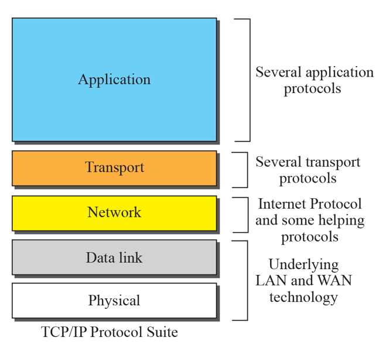
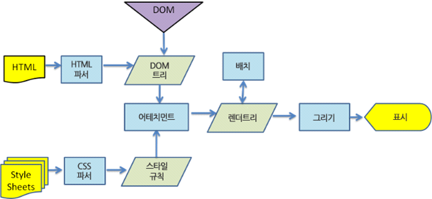
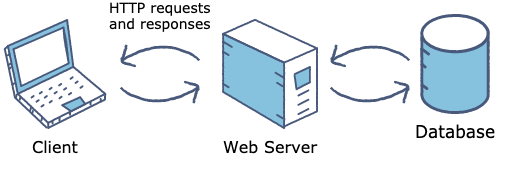
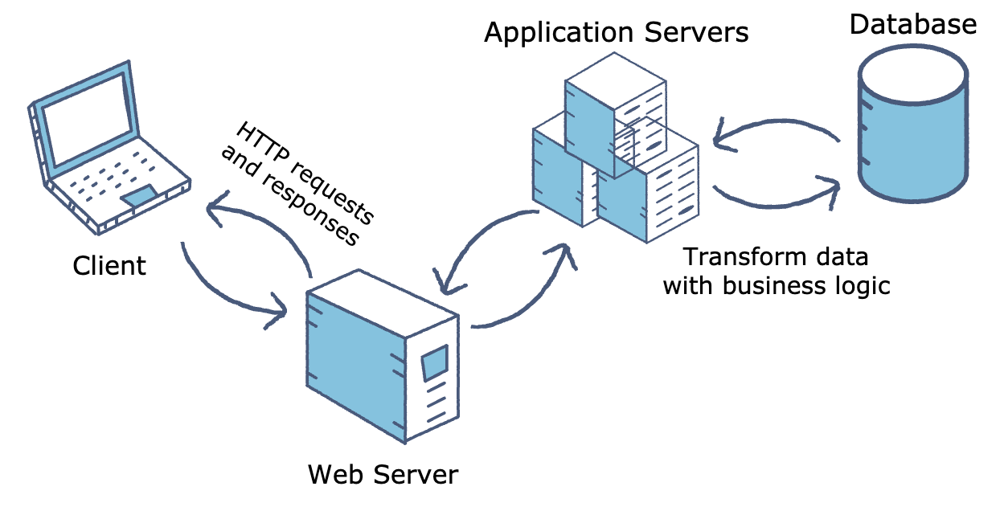

> 최초의 인터넷은 단순한 정보 전달만 가능했지만 점차 서로 정보를 교환할 수 있게 되었고, 최근은 개인 맞춤형 콘텐츠 및 서비스 제공 시대까지 이르렀다. 이러한 인터넷의 발전에 따라 웹의 동작 원리도 바뀌었다.

## Web이란?

**웹**([World Wide Web, WWW](https://en.wikipedia.org/wiki/World_Wide_Web))은 인터넷에 연결된 사용자들이 정보를 공개 및 공유할 수 있는 공간이다. 웹은 크게 세 가지 특징이 있다.

1. 텍스트, 그림, 영상 등의 정보를 보여주는 하이퍼텍스트 ex. HTML
2. 해당 공간의 위치(주소) ex. URL
3. 해당 문서나 자원에 접근하는 프로토콜 ex. HTTP

<details>
  <summary>🔍용어: 하이퍼텍스트, HTML, URL, HTTP</summary>
  <ul>
      <li><span style="font-weight: bold;">하이퍼텍스트(HyperText)</span>: 한 문서에서 다른 문서의 위치 정보를 심어서 양쪽을 연결해주는 텍스트</li>
      <li><span style="font-weight: bold;">HTML(HyperText Language)</span>: 웹을 위한 마크업*(태그 등을 이용해 문서나 데이터 구조를 명기하는 언어 중 하나)* 언어</li>
      <li><span style="font-weight: bold;">URL(Uniform Resource Locator)</span>: <span style="font-style: italic; color: gray;">https://www.rootenergy.co.kr/home</span> 와 같은 웹의 주소</li>
      <li><span style="font-weight: bold;">HTTP(HyperText Transfer Protocol)</span>: 웹 상에서 정보(하이퍼텍스트 문서)를 주고 받을 때 사용 되는 통신 규약</li>
  </ul>
</details>

<details>
  <summary style="font-weight: bold;">프로토콜</summary>
  프로토콜은 5개의 계층으로 나뉘는데, 위로 갈수록 사용자(클라이언트)와 가까운 작업을, 아래로 갈수록 기계와 가까운 작업을 담당한다.



  <ol>
      <li><span style="font-weight: bold;">애플리케이션 계층</span>: 서버와 클라이언트의 통신. ex. HTTP, SMTP, POP3, FTP 등</li>
      <li><span style="font-weight: bold;">통신 계층</span>: 데이터를 확실히 송/수신하기 위해 작동. 데이터를 `패킷`이라는 단위로 나누어 보내고, 이를 다시 조립하여 원래 데이터로 만듬. ex. TCP, UDP</li>
      <li><span style="font-weight: bold;">네트워크 계층</span>: 수신측 컴퓨터까지 데이터를 전달하기 위해 작동. 전달된 데이터의 손상 여부나 수신측이 잘 받았는지에 대해서는 관여하지 않음 ex. IP</li>
      <li><span style="font-weight: bold;">데이터 링크 계층</span>: 네트워크에 직접 연결된 기기 간을 전송할 수 있도록 만듬. ex. Ethernet, PPP 등</li>
      <li><span style="font-weight: bold;">물리 계층</span>: 데이터를 신호로, 신호를 데이터로 변환.</li>
  </ol>

이 다섯 가지의 프로토콜을 조합하면 다양한 애플리케이션이나 기기를 처리할 수 있다.

</details>

### 웹의 역사와 발전

**WEB 1.0**

- 1989년 팀 버너스리가 연구원 간에 아이디어를 주고받을 때 항상 전자 우편이나 파일을 통해 주고 받는 것이 비효율적이라 생각하여 제안한 것으로, 공통된 공간에 각자의 정보를 올리고 관리할 수 있는 일종의 정보 관리 시스템에서 시작되었다.
- 정리된 자료를 전달받는 형태로, 주로 텍스트와 링크로 이루어졌다. (정적인 형태)

**WEB 2.0**

- 2000년대 초, 사용자들이 웹에 글을 쓰거나 동영상을 올리는 등 직접 생산하고 참여하는 공간으로 바뀌었다.
- 회원등록 및 조회, 메일링, 게시판, 방명록 등의 CGI 프로그램의 등장이 컸다고 본다.

<details>
    <summary>🔍용어: CGI(Common Gateway Interface)</summary>
    <ul>
        <li>서버와 클라이언트 간의 정보 교환을 가능하게 해주는 것</li>
        <li>HTTP는 이전에 어떤 요청과 응답을 주고 받았는지 기억하지 못하는 일회성 규약이다. 하지만 CGI가 필요한 정보를 저장 했다가 다음에 필요할 때 다시 보낼 수 있게 되었다.</li>
    </ul>
</details>

**WEB 3.0**

- 2010년 이후, PC 뿐만이 아니라, 모바일, 태블릿 등 1인 1단말기가 보편화 되면서 개인화, 맞춤화 등의 인식이 생겼다. 컴퓨터 역시 시맨틱 웹(Semantic Web) 기술을 이용해 웹 페이지에 담긴 내용을 이해하고 사용자에게 맞춤형 콘텐츠 및 서비스를 제공할 수 있게 되었다.

<details>
    <summary>🔍용어: 시맨틱 웹</summary>
    <ul>
        <li>시맨틱: 페이지의 태그를 통해 의미 부여를 할 수 있는 기능</li>
    </ul>
    시맨틱 웹은 '의미론적인 웹'이라는 뜻으로, 인터넷 상의 리소스(웹 문서, 파일, 서비스 등)에 대한 정보와 자원 사이의 정보를 기계가 처리할 수 있는 온톨로지 형태로 표현하고, 이를 자동화된 기계(컴퓨터)가 처리하도록 하는 프레임워크이자 기술이다. <br />
    HTML5에서 시맨틱 웹을 쉽게 구성할 수 있도록 시맨틱 태그 요소들이 추가되었다.
</details>

<br />

## Web Server

**웹 서버**는 사용자들이 요청하는 정적인 페이지를 보여줄 때 사용된다. 정적인 페이지는 WEB 2.0까지 주로 다뤄졌던 HTML, 파일, 이미지, 비디오 등의 컨텐츠로 이루어진 페이지이다.

<details>
    <summary>🔍용어: 서버</summary>
    <ul>
        <li>서버: 클라이언트에게 네트워크를 통해 정보나 서비스를 제공하는 컴퓨터 프로그램 또는 장치</li>
    </ul>
</details>

<details>
  <summary style="font-weight: bold;">브라우저 동작 원리</summary>
  <p style="font-style: italic; font-size: 12px; color: gray;">- 참고: <a href="https://d2.naver.com/helloworld/59361" target="_blank">브라우저는 어떻게 동작하는가? 네이버 D2</a></p>
  <div>
  브라우저는 웹을 보기 위해 사용하는 프로그램으로 대표적인 브라우저에는 크롬, 사파리, IE, 파이어폭스 등이 있다.

  <h3>브라우저 구조</h3>


  <ul>
      <li><span style="font-weight: bold;">사용자 인터페이스</span>: 주소 표시줄, 이전/다음 버튼, 북마크, 메뉴 등 요청한 페이지를 보여주는 창을 제외한 사용자가 컨트롤 가능한 부분</li>
      <li><span style="font-weight: bold;">브라우저 엔진</span>: Use Interface와 Rending Engine 사이의 동작 제어 (ex. Webkit, Blink, Gecko)</li>
      <li><span style="font-weight: bold;">렌더링 엔진</span>: 요청받은 내용(HTML, CSS, JavaScript 등 파일)을 브라우저 화면에 보여주는 것</li>
      <li><span style="font-weight: bold;">통신</span>: HTTP 요청과 같은 네트워크 호출에 사용</li>
      <li><span style="font-weight: bold;">자바스크립트 해석기</span>: 자바스크립트를 해석하고 실행 (ex. V8 엔진)</li>
      <li><span style="font-weight: bold;">UI 백엔드</span>: 기본적인 위젯(ex. 콤보박스)을 화면에 그릴 때 필요</li>
      <li><span style="font-weight: bold;">자료 저장소</span>: 로컬 스토리지, 쿠키 등 클라이언트 사이드에서 데이터를 저장하는 영역</li>
  </ul>

  <br />

  <h3>렌더링 엔진(Webkit 기준)</h3>



  <ol>
      <li><span style="font-weight: bold;">파싱(Parsing)</span>: 파싱은 서버로부터 받은 문서를 브라우저가 이해할 수 있는 구조로 변환하는 과정을 뜻한다. 파싱 결과는 문서 구조를 나타내는 노드 트리라 하는데, HTML 문서를 파싱하여 DOM 트리를 만들고, CSS 문서를 파싱하여 CCSOM 트리를 만든다. </li>
      <li><span style="font-weight: bold;">구축(Attachment)</span>: DOM과 CCSOM 트리를 결합하여 렌더 트리를 만든다. </li>
      <li><span style="font-weight: bold;">배치(Layout)</span>: 렌더 트리가 만들어지면, 레이아웃(리플로우)을 배치하여 각 노드를 정확한 위치에 표시하기 위해 크기를 계산한다. (ex. CSS에서 %로 할당된 값을 px 단위로 변환)</li>
      <li><span style="font-weight: bold;">그리기(Paint)</span>: 계산된 위치와 크기 등을 실제 픽셀로 표현한다. </li>
  </ol>
  </div>

</details>

대표적인 Web Server에는 Nginx(ex. Dropbox, Netflix, Wordpress.com 등), Apache HTTP Server가 있다.

<div style="text-align: center;">
<p style="font-size: 11px; color: gray;">cccd</p></div>


## WAS(Web Application Server)

**Web Application**

**웹 애플리케이션**은 웹상에서 단순히 동적으로 페이지를 출력하는 것 보다, 웹에서 특정 업무를 처리하는 것을 뜻한다. 예를 들면, 어떠한 소스 파일을 특정 파일로 변환, 회사 실무 관리나 DB 관리, 혹은 HTML5 Canvas를 이용한 게임 등이 있다.

여기서 알 수 있듯이, Web Server와 WAS의 가장 큰 차이는 동적 데이터(비즈니스 로직) 처리 가능 여부이다.

<details>
    <summary>🔍용어: 비즈니스 로직(Business Logic)</summary>
    <ul>
        <li>동적 데이터 생성 및 작업</li>
        <li>클라이언트가 원하는 데이터를 보여주기 위해, 데이터베이스에 연결, 생성, 변경, 저장하는 작업</li>
        <li>ex. 회원 가입을 위해 아이디 작성 후 제출하면, 데이터베이스에 중복된 아이디가 있는지 연결하여 확인 및 결과를 클라이언트에 전달</li>
    </ul>
</details>

<div style="text-align: center;">
<p style="font-size: 11px; color: gray;">cccd</p></div>

WAS는 Web server에 Application servers가 추가된 것이다. 애플리케이션 서버는 웹 서버와 데이터베이스 사이에서 웹 서버 대신 데이터베이스와 통신하여 동적인 데이터를 처리해주는 미들웨어이다.

대표적인 WAS에는 Apache Tomcat, Glassfish 등이 있다.

<br />

### 실습

**Docker로 cra+nginx, express 띄워보기 (Github repo)**

- [react-nginx-docker](https://github.com/howdy-mj/react-nginx-docker)
- [express-with-docker](https://github.com/howdy-mj/express-with-docker)

<br />

## Node.js는 웹 서버인가?

공식 홈페이지에 `Node.js는 Chrome V8 JavaScript 엔진으로 빌드된 JavaScript 런타임` 이라고 나와 있다.

<details>
    <summary>🔍용어: V8, JavaScript 엔진, 런타임</summary>
    <ul>
        <li>V8: C++로 작성된 구글의 오픈소스 고성능 자바스크립트와 웹어셈블리(C/C++을 웹에서 동작할 수 있도록 컴파일) 엔진</li>
        <li>JavaScript 엔진: 자바스크립트를 해석하고 실행하는 프로그램 또는 언어</li>
        <li>런타임: 프로그램이 실행되는 환경</li>
    </ul>
</details>

Node.js는 웹 서버가 아니지만 직접 HTTP 서버를 작성하면 웹 서버를 띄울 수 있는 환경을 만들어준다. 그러나 일일이 Node.js로 웹 서버에 필요한 기능을 짜면 해야할 것이 너무 많기 때문에, Node.js의 프레임워크 Express, Koa, Hapi 등을 사용하면 보다 더 간단하게 웹 서버를 구축할 수 있다.

하지만 Node.js는 한 번에 한 가지 일밖에 처리하지 못하므로 간단한 작업은 괜찮지만, CPU 부하가 큰 프로젝트(ex. 암호화폐 채굴)를 진행할 경우 과부하가 올 수 있기 때문에 NginX 등 다른 웹 서버를 연결해야 한다.

```js
// http 모듈 import
const http = require('http')

// http 서버 객체 생성, request 이벤트가 발생하면 response를 반환
const server = http.createServer(function(req, res) {
  // 정상적으로 값을 리턴하면, 컨텐츠 타입은 text, html 형태로 화면에 출력
  res.writeHead(200, { 'Content-Type': 'text/html' })
  // res.write의 첫 번째 인자는 클라이언트로 보낼 데이터, HTML을 보낼 수도, 버퍼를 보낼 수도 있음
  res.write('<html><body><p>Homepage</p></body></html>')
  // res.end는 응답을 종료하는 메서드. 만약 인자가 있다면, 그 데이터를 클라이언트로 보내고 종료
  res.end()
})

// http 서버 객체를 5000 포트로 전달하여 서버 실행
server.listen(5000)

console.log('Node.js web server at port 5000 is running')
```

### 실습 (Github repo)

- [practice-node-server](https://github.com/howdy-mj/practice-node-server)

<br />

**참고**

<div style="font-size: 12px;">

- https://hack-cracker.tistory.com/146

- https://www.ibm.com/cloud/learn/web-server-vs-application-server

- https://www.educative.io/edpresso/web-server-vs-application-server

- https://www.edwith.org/boostcourse-web/lecture/16666/

- https://gmlwjd9405.github.io/2018/10/27/webserver-vs-was.html

- https://passionha.tistory.com/341

- https://jeong-pro.tistory.com/84

</div>
